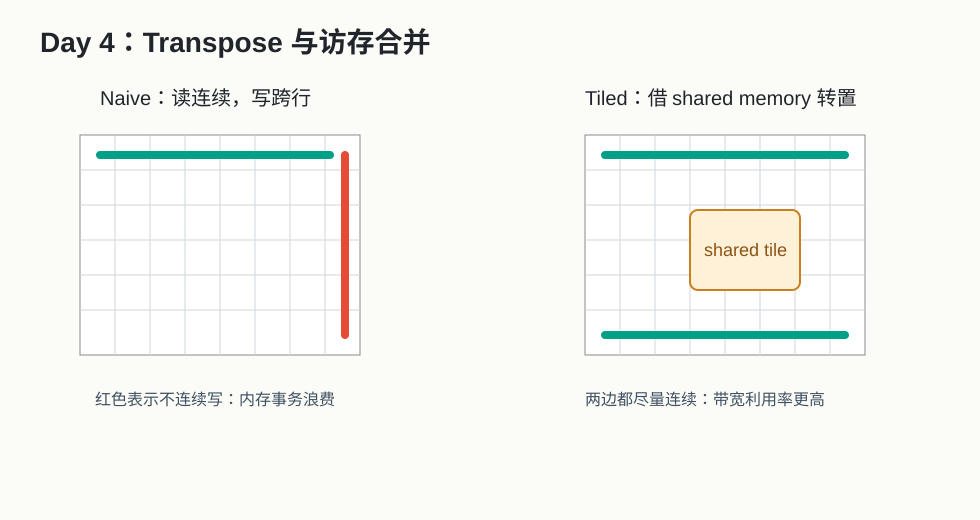
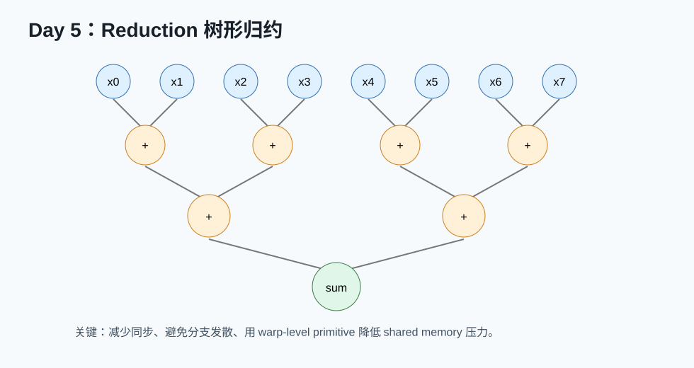
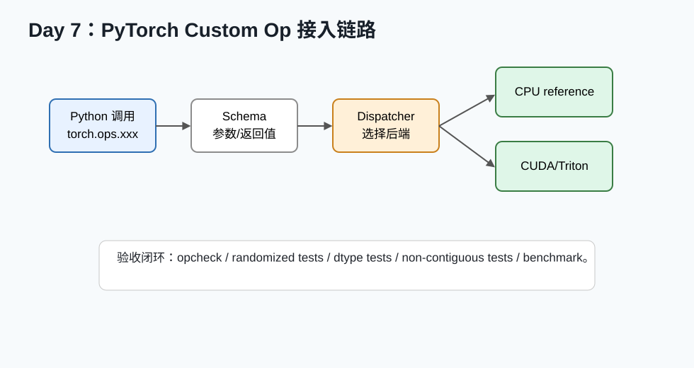

# 14 天算子开发与优化强化营

生成日期：2026-05-26  
定位：入职前救急，但不是糊弄式速成。目标是在 14 天内建立“能读资料、能跑实验、能定位瓶颈、能和同事对话”的最小闭环。  
建议节奏：每天 3-5 小时。如果时间更少，优先完成“必读 + 动手任务 + 当天输出”。

---

## 使用说明

这个计划把原来的 14 天救急路线拆成每天一份小讲义。每一天都包含：

- **今日目标**：今天必须建立的概念。
- **图片导读**：用一张本地图帮你先建立直觉。
- **资料清单**：优先官方文档、论文、官方博客。
- **精读路径**：告诉你资料看哪几节，不让你被文档海淹没。
- **动手任务**：当天最好写出来或至少跑通的小实验。
- **验收标准**：判断今天是不是学到了位。
- **常见坑**：新人最容易卡住的地方。
- **当天输出**：留下可复用的笔记、代码或表格。

资料可靠性：

- A：官方文档、官方规范、顶会/期刊论文、官方教程。
- B：官方技术博客、官方 GitHub、作者团队博客。
- C：个人博客和二次整理，只作为辅助。

本目录下已经准备好：

- 论文 PDF：[`papers`](papers)
- 论文中文导读：[`paper_notes`](paper_notes)
- 每日配图：[`assets`](assets)

---

## Day 1：硬件地图，先知道自己在和谁打交道


### 今日目标

你今天只做一件事：建立 CPU/GPU/NPU 的内存层次和并行模型直觉。不要急着写复杂 kernel。算子优化的第一层心法是：**计算很快，搬数据常常很慢**。

### 必读资料

1. [CUDA C++ Programming Guide](https://docs.nvidia.com/cuda/cuda-c-programming-guide/index.html)  
   可靠性：A。读 `Programming Model`、`Memory Hierarchy`、`Thread Hierarchy` 相关章节。
2. [CUDA C++ Best Practices Guide](https://docs.nvidia.com/cuda/cuda-c-best-practices-guide/index.html)  
   可靠性：A。今天只浏览目录，知道它以后是优化手册。
3. [AMD HIP Documentation](https://rocmdocs.amd.com/projects/HIP/en/latest/index.html)  
   可靠性：A。选读，用来理解 CUDA 概念可以迁移到 AMD/HIP。

### 精读路径

按下面顺序读，不要从第一页一直读到最后：

1. CUDA 编程模型：看 grid、block、thread 三个词。
2. CUDA 内存层次：看 register、shared memory、global memory。
3. CUDA 异步执行：知道 kernel launch 后 CPU/GPU 通常是异步的。
4. Best Practices Guide 目录：把 coalescing、occupancy、shared memory、bandwidth 这几个词圈出来。

### 你今天要真正理解的 8 个词

| 词 | 入门解释 |
|---|---|
| SM / CU / AI Core | 硬件执行单元，类似 GPU/NPU 上的“工厂车间” |
| Thread | 最小执行单位之一，很多线程一起跑 |
| Warp / Wavefront | 一组线程一起调度执行 |
| Register | 每个线程私有的最快存储 |
| Shared memory / SRAM | 片上小容量高速存储，程序员可控 |
| Global memory / HBM | 大容量显存，带宽高但延迟大 |
| Occupancy | 一个执行单元上同时驻留多少活跃线程/warp |
| Coalescing | 相邻线程访问连续地址，让内存事务更高效 |

### 动手任务

不要求写代码也可以，但最好做：

1. 画一张自己的硬件层次图，可以照着本日图片画。
2. 写一个表，把 CPU cache 和 GPU shared memory 区分开。
3. 用自己的话解释：为什么 GPU 很快，但写得不好的 kernel 会很慢。

### 验收标准

你能回答：

- 为什么 global memory 比 register/shared memory 慢？
- 为什么 GPU 需要大量线程隐藏延迟？
- 为什么“连续访问”通常比“跳着访问”快？
- 为什么算子优化经常先看内存，而不是先看数学公式？

### 常见坑

- 把 shared memory 当成 CPU cache。shared memory 通常需要你显式搬数据、显式同步。
- 以为 occupancy 越高越好。occupancy 是工具，不是目的；寄存器压力、访存、指令吞吐都可能更重要。
- 把 GPU 线程理解成 CPU 线程。GPU 线程更轻量，但单线程能力弱很多。

### 当天输出

写一个 `day01_hardware_notes.md`，至少包含：

```text
1. CPU 和 GPU/NPU 内存层次对比
2. register/shared/global 的区别
3. 我对 coalescing 的理解
4. 我现在还不懂的 3 个问题
```

---

## Day 2：Roofline，学会判断瓶颈


### 今日目标

今天建立性能模型。你要学会把一个算子初步判断成：

- memory-bound：卡在数据搬运。
- compute-bound：卡在计算吞吐。
- launch-bound：算子太小，启动开销占比大。

### 必读资料

1. 本地论文 PDF：[Roofline Model](papers/01_Roofline_EECS-2008-134.pdf)  
   中文讲解：[Roofline 中文讲解](paper_notes/01_Roofline_中文讲解.md)  
   可靠性：A。
2. [NVIDIA Deep Learning Performance: Matrix Multiplication Background](https://docs.nvidia.com/deeplearning/performance/dl-performance-matrix-multiplication/index.html)  
   可靠性：A。今天重点看 arithmetic intensity。
3. [Nsight Compute Documentation](https://docs.nvidia.com/nsight-compute/NsightCompute/index.html)  
   可靠性：A。今天只知道这个工具以后用来查性能计数器。

### 精读路径

1. 先读中文讲解，不要直接硬啃英文论文。
2. 看 Roofline 图：横轴是算术强度，纵轴是性能。
3. 把三个算子放到图上：vector add、softmax、GEMM。
4. 读 NVIDIA matrix multiplication 文档里关于算术强度的部分。

### 关键公式

```text
算术强度 = FLOPs / Bytes
```

粗略估算例子：

- `y = x + 1`：读 x、写 y，只做一次加法，算术强度很低。
- `C = A @ B`：A/B 元素被反复复用，算术强度高。
- `softmax`：有 exp 和 reduction，但通常仍强依赖内存读写。

### 动手任务

做一个小表：

| 算子 | 读写数据 | 计算量 | 你猜的瓶颈 |
|---|---|---|---|
| vector add | 读 x/y 写 z | 很少 | memory-bound |
| transpose | 读 A 写 B | 很少 | memory-bound + 访问模式 |
| softmax | 多次读写一行 | 中等 | memory-bound/reduction |
| GEMM | 读 A/B 写 C | 很多 | 可能 compute-bound |

### 验收标准

你能解释：

- 为什么 GEMM 比 elementwise 更容易跑到高 FLOPS。
- 为什么减少中间 tensor 写回 HBM 非常重要。
- 为什么同一个优化技巧对不同算子不一定有用。

### 常见坑

- 把理论峰值当实际性能。真实 kernel 还会受访存、同步、寄存器、调度影响。
- 只看 FLOPS，不看 bytes。很多算子慢不是算不动，是搬不动。
- 忽视小 shape 的 launch overhead。

### 当天输出

写一页 `day02_roofline_notes.md`：

```text
我理解的 memory-bound:
我理解的 compute-bound:
vector add / softmax / GEMM 的瓶颈猜测:
我以后做 benchmark 时要记录的硬件信息:
```

---

## Day 3：第一个 Kernel，Vector Add 与计时


### 今日目标

今天写出第一个真正的设备 kernel。不要小看 vector add，它能让你一次性接触：

- grid/block/thread 映射。
- 全局索引计算。
- 边界判断。
- GPU 异步执行与正确计时。
- correctness check。

### 必读资料

1. [CUDA C++ Programming Guide: Kernels / Thread Hierarchy](https://docs.nvidia.com/cuda/cuda-c-programming-guide/index.html)  
   可靠性：A。
2. [CUDA Runtime API: Event Management](https://docs.nvidia.com/cuda/cuda-runtime-api/group__CUDART__EVENT.html)  
   可靠性：A。用于正确计时。
3. [PyTorch Benchmark Utils](https://docs.pytorch.org/docs/stable/benchmark_utils.html)  
   可靠性：A。选读，如果你用 PyTorch/Triton 跑实验。

### 精读路径

今天只看这些点：

1. `__global__` kernel 是什么。
2. `blockIdx.x`、`blockDim.x`、`threadIdx.x` 怎么算全局 index。
3. 为什么要写 `if (idx < n)`。
4. 为什么计时前后要同步或使用 CUDA event。

### 最小代码结构

你可以按这个思路写：

```cpp
__global__ void vector_add(const float* a, const float* b, float* c, int n) {
    int idx = blockIdx.x * blockDim.x + threadIdx.x;
    if (idx < n) {
        c[idx] = a[idx] + b[idx];
    }
}
```

主机侧要做：

```text
分配 host/device memory
初始化输入
copy host -> device
launch kernel
copy device -> host
和 CPU/PyTorch reference 比较
用 event 或同步方式计时
```

### 动手任务

1. 写 `vector_add`。
2. 测 `n = 1K, 1M, 100M`。
3. 改 `blockDim = 128, 256, 512`，记录时间。
4. 计算有效带宽：

```text
有效带宽 = (读 A + 读 B + 写 C) / kernel_time
```

### 验收标准

你能回答：

- 为什么 `idx < n` 是必须的？
- 为什么 GPU 计时不能只用 CPU 的普通计时包住 launch？
- 为什么 vector add 的优化重点是带宽，而不是加法本身？

### 常见坑

- 忘记同步导致计时几乎为 0。
- 网格大小没有向上取整，最后一段数据没处理。
- 只测一次，没有 warmup。
- 把 host-device copy 时间和 kernel 时间混在一起，导致不知道瓶颈在哪。

### 当天输出

保存一个表：

| n | blockDim | kernel time | effective bandwidth | 是否正确 |
|---|---:|---:|---:|---|

---

## Day 4：Transpose，第一次感受访存合并



### 今日目标

今天你要用 transpose 亲手理解 coalescing。矩阵转置计算量很少，但访问模式很容易变差，是学习内存优化的经典案例。

### 必读资料

1. [NVIDIA: Efficient Matrix Transpose in CUDA C/C++](https://developer.nvidia.com/blog/efficient-matrix-transpose-cuda-cc/)  
   可靠性：B，NVIDIA 官方博客，强烈推荐精读。
2. [CUDA Best Practices Guide: Coalesced Access to Global Memory](https://docs.nvidia.com/cuda/cuda-c-best-practices-guide/index.html)  
   可靠性：A。
3. [CUDA Best Practices Guide: Shared Memory](https://docs.nvidia.com/cuda/cuda-c-best-practices-guide/index.html)  
   可靠性：A。

### 精读路径

1. 先读 NVIDIA transpose 博客的 naive transpose。
2. 看 copy kernel 为什么快。
3. 看 naive transpose 为什么写不连续。
4. 看 tiled transpose 如何用 shared memory 转换访问模式。
5. 注意 padding 如何缓解 bank conflict。

### 动手任务

实现三个版本：

1. copy：`B[i,j] = A[i,j]`
2. naive transpose：`B[j,i] = A[i,j]`
3. tiled transpose：先读到 shared memory tile，再转置写出

记录：

| 版本 | 读是否连续 | 写是否连续 | 是否用 shared memory | 带宽 |
|---|---|---|---|---:|

### 关键理解

Naive transpose 慢，不是因为转置数学很难，而是因为相邻线程写到相隔很远的地址，内存事务效率差。

Tiled transpose 的思想：

```text
global memory 连续读 -> shared memory 中转 -> global memory 连续写
```

### 验收标准

你能解释：

- coalesced load/store 是什么。
- 为什么 transpose 的读写有一边天然不连续。
- shared memory 在这里不是为了存更多数据，而是为了改变访问模式。

### 常见坑

- tile 维度和矩阵边界处理不正确。
- 忘记 `__syncthreads()`，导致 shared memory 数据还没写完就被读。
- shared memory tile 不加 padding，可能出现 bank conflict。

### 当天输出

写一页 `day04_transpose_report.md`：

```text
naive transpose 慢在哪里:
tiled transpose 如何修复:
我的带宽测试表:
我对 shared memory 的新理解:
```

---

## Day 5：Reduction，Softmax/Norm 的底层骨架



### 今日目标

今天学 reduction。它是 softmax、layernorm、rmsnorm、attention、统计类算子的骨架。

### 必读资料

1. 本地 PDF：[NVIDIA Optimizing Parallel Reduction](papers/02_NVIDIA_Optimizing_Parallel_Reduction.pdf)  
   中文讲解：[Reduction 中文讲解](paper_notes/02_NVIDIA_Reduction_中文讲解.md)  
   可靠性：B，NVIDIA 官方技术资料。
2. [CUDA C++ Programming Guide: Cooperative Groups / Synchronization](https://docs.nvidia.com/cuda/cuda-c-programming-guide/index.html)  
   可靠性：A。今天只看同步概念。
3. [CUDA Best Practices Guide: Shared Memory and Memory Optimizations](https://docs.nvidia.com/cuda/cuda-c-best-practices-guide/index.html)  
   可靠性：A。

### 精读路径

按这个顺序：

1. 先看中文讲解。
2. 看 PDF 里的第一个 naive reduction。
3. 每看到一个优化版本，就问：它减少了什么？
4. 重点理解分支发散、bank conflict、循环展开、多元素每线程。

### 动手任务

实现：

1. row-wise sum：输入 `[M, N]`，输出 `[M]`。
2. row-wise max：输入 `[M, N]`，输出 `[M]`。

shape 建议：

```text
M = 1024
N = 32, 64, 128, 256, 1024, 4096
```

比较：

- CPU/PyTorch reference。
- 不同 block size。
- 每个线程处理 1 个元素 vs 多个元素。

### 验收标准

你能回答：

- 为什么 reduction 需要同步？
- 为什么一个 block 处理一行是常见设计？
- 当 N 很大，一个 block 不够时怎么办？
- sum 和 max 在数值/初始化上有什么差异？

### 常见坑

- max 初始化成 0，导致负数输入结果错。应该用负无穷或第一个元素。
- FP16/BF16 直接半精度累加，误差可能很大。常用 FP32 accumulate。
- 忽略非 2 的幂长度，尾部处理错。

### 当天输出

保存：

```text
row_sum kernel
row_max kernel
不同 N 的性能表
一段解释：为什么 reduction 是 softmax/layernorm 的基础
```

---

## Day 6：Softmax 与 LayerNorm，写第一个“像样”的深度学习算子


### 今日目标

今天把 Day 5 的 reduction 用到真实深度学习算子里：softmax、layernorm/rmsnorm。

### 必读资料

1. [Triton Fused Softmax Tutorial](https://triton-lang.org/main/getting-started/tutorials/02-fused-softmax.html)  
   可靠性：A。即使你今天用 CUDA 写，也要读它的算法结构。
2. [Triton Layer Normalization Tutorial](https://triton-lang.org/main/getting-started/tutorials/05-layer-norm.html)  
   可靠性：A。今天可先读 forward。
3. [PyTorch torch.nn.functional.softmax](https://docs.pytorch.org/docs/stable/generated/torch.nn.functional.softmax.html)  
   可靠性：A。用于理解 reference 语义。
4. [PyTorch LayerNorm](https://docs.pytorch.org/docs/stable/generated/torch.nn.LayerNorm.html)  
   可靠性：A。用于理解 epsilon、normalized_shape、weight/bias。

### 精读路径

Softmax：

1. 为什么要 `x - max(x)`。
2. 为什么需要两次 reduction：max 和 sum。
3. 为什么 fused softmax 可以减少 HBM 中间写回。

LayerNorm：

1. 每行求 mean。
2. 每行求 variance 或 RMS。
3. 用 FP32 做统计，再转回输出 dtype。
4. 可选 weight/bias。

### 动手任务

实现两个 forward：

1. stable softmax：

```text
m = max(x_i)
e_i = exp(x_i - m)
s = sum(e_i)
y_i = e_i / s
```

2. RMSNorm：

```text
rms = sqrt(mean(x_i^2) + eps)
y_i = x_i / rms * weight_i
```

建议先支持 contiguous `[M, N]`，不要一开始支持所有 stride。

### 误差标准建议

| dtype | 建议比较 |
|---|---|
| FP32 | `rtol=1e-5, atol=1e-6` |
| FP16 | `rtol=1e-2, atol=1e-3` |
| BF16 | `rtol=2e-2, atol=2e-2` |

具体标准以公司/项目为准。

### 验收标准

你能回答：

- Softmax 为什么要减最大值？
- LayerNorm 为什么常用 FP32 accumulate？
- 为什么 fused softmax 比拆成 max/exp/sum/div 多个 kernel 更可能快？
- hidden size 不同，block size 应该怎么想？

### 常见坑

- `exp` 溢出，导致 Inf/NaN。
- variance 公式写错。
- epsilon 加在错误位置。
- 忘记处理 N 不是 2 的幂。
- 只测试正态分布输入，没有测试极大/极小值。

### 当天输出

保存：

```text
softmax forward
rmsnorm 或 layernorm forward
和 PyTorch reference 的误差表
不同 hidden size 的性能表
```

---

## Day 7：PyTorch Custom Op，把 Kernel 接进真实框架



### 今日目标

今天从“我会写 kernel”走到“Python/PyTorch 能稳定调用我的算子”。这一步非常重要，因为真实公司任务往往是端到端接入，而不是孤立 kernel。

### 必读资料

1. [PyTorch Custom C++ and CUDA Operators](https://docs.pytorch.org/tutorials/advanced/cpp_custom_ops.html)  
   可靠性：A，今天主读。
2. [Registering a Dispatched Operator in C++](https://docs.pytorch.org/tutorials/advanced/dispatcher.html)  
   可靠性：A，理解 dispatcher。
3. [torch.library.opcheck](https://docs.pytorch.org/docs/stable/library.html)  
   可靠性：A，理解 custom op 测试。

### 精读路径

1. 先看 custom op 的最小例子。
2. 理解 schema：输入输出是什么。
3. 理解 CPU implementation 和 CUDA implementation 可以分开注册。
4. 理解 FakeTensor/meta kernel 的意义：让编译器知道 shape。
5. 看 opcheck 怎么帮你检查基础行为。

### 动手任务

把 Day 6 的 RMSNorm 或 Softmax 接入 PyTorch。

最低要求：

```text
Python: torch.ops.my_ops.rms_norm(x, weight, eps)
CPU fallback: 用 PyTorch 或 C++ reference
CUDA/Triton backend: 调你的 kernel
测试: 和 torch reference 比较
```

### 推荐测试

| 测试类型 | 示例 |
|---|---|
| shape | `[1, 128]`, `[32, 768]`, `[8, 4096]` |
| dtype | FP32、FP16、BF16 |
| contiguous | 连续 tensor |
| non-contiguous | `x[:, ::2]` 或 transpose 后输入 |
| 极值 | 大正数、大负数、全 0 |
| 随机 | 固定 seed 多组随机 shape |

### 验收标准

你能回答：

- PyTorch dispatcher 是干什么的？
- CPU fallback 为什么重要？
- custom op 为什么要有 reference test？
- 一个 op 接入框架后，benchmark 该测 kernel 时间还是端到端时间？

### 常见坑

- 只测 contiguous，线上来了 non-contiguous 就错。
- Python 包装层没有检查 dtype/device。
- CUDA kernel 报错没有同步，错误延迟到后面才出现。
- 只写 forward，忘记说明 backward 是否支持。

### 当天输出

一个最小 custom op 项目：

```text
my_ops/
  setup 或 CMake 配置
  Python 调用示例
  CPU reference
  CUDA/Triton kernel
  tests/
  benchmark/
```

---

## Day 8：Triton 入门，用块级思维写 Kernel


### 今日目标

今天学 Triton 的基本编程模型。Triton 适合快速写 fused kernel，也是很多框架编译器生成 GPU kernel 的重要路线。

### 必读资料

1. [Triton Tutorials](https://triton-lang.org/main/getting-started/tutorials/)  
   可靠性：A。
2. [Triton Language API](https://triton-lang.org/main/python-api/triton.language.html)  
   可靠性：A。查 `tl.load`、`tl.store`、`tl.arange`、`tl.program_id`。
3. 本地论文 PDF：[Triton MAPL 2019](papers/03_Triton_MAPL2019.pdf)  
   中文讲解：[Triton 中文讲解](paper_notes/03_Triton_中文讲解.md)  
   可靠性：A。

### 精读路径

1. 先读中文讲解。
2. 看官方 vector add 或 basic tutorial。
3. 理解 `program_id`：它决定当前 program 处理哪块数据。
4. 理解 `tl.arange`：它生成一个 block 内的偏移向量。
5. 理解 mask：处理越界。

### Triton 心智模型

CUDA：

```text
每个 thread 做一个或几个元素
```

Triton：

```text
每个 program 做一个 tile / 一行 / 一个 block
```

### 动手任务

用 Triton 写：

1. vector add。
2. `y = relu(x * scale + bias)` fused elementwise。
3. 对不同 BLOCK_SIZE 做 benchmark。

### 验收标准

你能回答：

- `tl.program_id(0)` 是什么？
- `tl.arange(0, BLOCK_SIZE)` 生成什么？
- mask 为什么重要？
- Triton 和 CUDA 的思维差异是什么？

### 常见坑

- BLOCK_SIZE 设太大导致寄存器压力或编译失败。
- mask 写错，越界读写。
- benchmark 没 warmup。
- 把 Triton 当 NumPy，忘记它最终是并行 kernel。

### 当天输出

保存：

```text
triton_vector_add.py
triton_fused_elementwise.py
不同 BLOCK_SIZE 的 benchmark 表
```

---

## Day 9：Triton Fused Softmax，理解减少 HBM 写回


### 今日目标

今天把 Day 6 的 softmax 用 Triton 写出来，并理解“融合”为什么能快。

### 必读资料

1. [Triton Fused Softmax Tutorial](https://triton-lang.org/main/getting-started/tutorials/02-fused-softmax.html)  
   可靠性：A，今天主读。
2. [Triton Benchmarking API](https://triton-lang.org/main/python-api/generated/triton.testing.do_bench.html)  
   可靠性：A。
3. [PyTorch Softmax Reference](https://docs.pytorch.org/docs/stable/generated/torch.nn.functional.softmax.html)  
   可靠性：A。

### 精读路径

官方教程逐段看：

1. 输入矩阵 `[n_rows, n_cols]`。
2. 一个 Triton program 处理一行。
3. BLOCK_SIZE 通常取大于等于 `n_cols` 的 2 的幂。
4. `tl.load(..., mask=..., other=-inf)`。
5. `row_minus_max = row - tl.max(row, axis=0)`。
6. `numerator = tl.exp(row_minus_max)`。
7. `denominator = tl.sum(numerator, axis=0)`。
8. `tl.store` 输出。

### 动手任务

1. 跑通官方 fused softmax。
2. 改 shape：

```text
n_rows = 1024, 4096
n_cols = 128, 256, 512, 1024, 2048, 4096
```

3. 对比：

- PyTorch eager softmax。
- `torch.compile` 版本。
- Triton fused softmax。

### 重点观察

| shape | PyTorch eager | torch.compile | Triton | 谁快 | 可能原因 |
|---|---:|---:|---:|---|---|

注意：不同硬件和软件版本结果会不同，不要背结论。你要学会解释。

### 验收标准

你能回答：

- Fused softmax 少写回了哪些中间结果？
- 为什么一行太长时一个 program 可能吃不下？
- BLOCK_SIZE 为什么常取 2 的幂？
- Triton 的 num_warps 怎么影响性能？

### 常见坑

- `n_cols` 太大超过 block 能力。
- 输出误差和 PyTorch 不一致但没检查 dtype。
- 只测大 shape，忽略小 shape launch overhead。

### 当天输出

保存：

```text
triton_softmax.py
softmax_correctness_test.py
softmax_benchmark.csv
一段 300 字解释：fused softmax 为什么减少 HBM 访问
```

---

## Day 10：Triton Matmul 与 LayerNorm，进入高频算子区


### 今日目标

今天用 Triton 读懂 matmul 教程，同时补齐 layernorm/rmsnorm 的 Triton 实现思路。

### 必读资料

1. [Triton Matrix Multiplication Tutorial](https://triton-lang.org/main/getting-started/tutorials/03-matrix-multiplication.html)  
   可靠性：A，今天主读。
2. [Triton Layer Normalization Tutorial](https://triton-lang.org/main/getting-started/tutorials/05-layer-norm.html)  
   可靠性：A。
3. [NVIDIA Matrix Multiplication Background](https://docs.nvidia.com/deeplearning/performance/dl-performance-matrix-multiplication/index.html)  
   可靠性：A。配合 Day 11 深读。

### 精读路径

Matmul 教程只抓这些：

1. `C[M,N] = A[M,K] @ B[K,N]`。
2. 一个 program 负责 C 的一个 tile。
3. `BLOCK_M`、`BLOCK_N`、`BLOCK_K` 的含义。
4. 沿 K 维循环累加 accumulator。
5. accumulator 通常用 FP32。
6. 最后 store C tile。

LayerNorm 教程抓这些：

1. 每行 mean/variance。
2. 使用 block load。
3. backward 今天可跳过，先读 forward。

### 动手任务

1. 跑通 Triton matmul 教程。
2. 改 3 组 shape：

```text
M=N=K=512
M=N=K=1024
M=4096, K=4096, N=4096
```

3. 对比 PyTorch `torch.matmul`。
4. 跑通 Triton LayerNorm forward 或 RMSNorm forward。

### 验收标准

你能回答：

- `BLOCK_M/N/K` 各自影响什么？
- 为什么 matmul accumulator 常用 FP32？
- 为什么 Triton matmul 不一定打得过 cuBLAS？
- LayerNorm 和 softmax 的共同点是什么？

### 常见坑

- 以为自己手写 matmul 很容易超过 cuBLAS。vendor library 是多年优化结果，超过它不是新手目标。
- 只看一个 shape。matmul 性能极度 shape-dependent。
- 没处理 stride/layout。

### 当天输出

保存：

```text
triton_matmul.py
triton_layernorm_or_rmsnorm.py
matmul shape sweep 表
一句话总结：手写 matmul 的价值和边界
```

---

## Day 11：GEMM 与 Tensor Core，理解算子优化的中心战场


### 今日目标

今天不追求手写极致 GEMM，而是建立 GEMM 的分层优化直觉。GEMM 是深度学习里最重要的算子之一，也是理解 Tensor Core/MMA、tiling、epilogue fusion 的入口。

### 必读资料

1. [NVIDIA Matrix Multiplication Background](https://docs.nvidia.com/deeplearning/performance/dl-performance-matrix-multiplication/index.html)  
   可靠性：A，今天主读。
2. [CUTLASS Efficient GEMM in CUDA](https://docs.nvidia.com/cutlass/latest/media/docs/cpp/efficient_gemm.html)  
   可靠性：A。今天先读思想，Day 12 再读接口。
3. [CUDA C++ Programming Guide: WMMA](https://docs.nvidia.com/cuda/cuda-c-programming-guide/index.html)  
   可靠性：A。选读，知道 Tensor Core 编程入口。

### 精读路径

1. 先读 NVIDIA matrix multiplication 文档，理解 M/N/K、算术强度。
2. 看 GEMM 为什么需要 tiling。
3. 看 CUTLASS Efficient GEMM 中的 CTA tile、warp tile、instruction tile。
4. 理解 epilogue：GEMM 主计算后融合 bias、activation、scale。

### 动手任务

实现或至少读懂：

1. naive GEMM：

```text
每个线程算 C 的一个元素
for k in K: acc += A[m,k] * B[k,n]
```

2. shared-memory tiled GEMM：

```text
A tile / B tile 搬到 shared memory
同步
每个线程复用 tile 里的数据累加
```

3. 比较 naive、tiled、PyTorch/cuBLAS。

### 验收标准

你能回答：

- GEMM 为什么有高算术强度？
- CTA tile、warp tile、instruction tile 分别是什么层级？
- epilogue fusion 为什么有价值？
- 小矩阵、大矩阵、batched GEMM 的优化策略为什么不同？

### 常见坑

- 只关注乘加，不关注 A/B 的复用。
- tile 太大导致 shared memory 或寄存器压力过高。
- 忘记边界 mask。
- 忽略 layout：row-major/column-major 会影响访问。

### 当天输出

保存：

```text
naive_gemm
tiled_gemm
和 PyTorch/cuBLAS 的对比表
一张自己画的 GEMM tiling 图
```

---

## Day 12：CUTLASS/CuTe，站在成熟库肩膀上


### 今日目标

今天认识 CUTLASS。你不需要一天看懂所有模板，但要知道它解决什么问题、怎么分层、什么时候应该用它。

### 必读资料

1. [CUTLASS Efficient GEMM in CUDA](https://docs.nvidia.com/cutlass/latest/media/docs/cpp/efficient_gemm.html)  
   可靠性：A。
2. [CUTLASS 3.x GEMM API](https://docs.nvidia.com/cutlass/latest/media/docs/cpp/gemm_api_3x.html)  
   可靠性：A。
3. [CuTe GEMM Tutorial](https://docs.nvidia.com/cutlass/latest/media/docs/cpp/cute/0x_gemm_tutorial.html)  
   可靠性：A。
4. [CUTLASS GitHub](https://github.com/NVIDIA/cutlass)  
   可靠性：B，官方代码。

### 精读路径

今天重点看：

1. CUTLASS 为什么要分 device/kernel/collective/atom。
2. GEMM mainloop 和 epilogue 分别负责什么。
3. CuTe 的 layout 抽象为什么重要。
4. 找一个 example，不要一开始追模板源头。

### 动手任务

如果环境能编译 CUTLASS：

1. clone 或打开 CUTLASS 示例。
2. 编译一个 GEMM example。
3. 改 M/N/K 和 dtype。
4. 跑 benchmark。

如果环境暂时不能编译：

1. 阅读一个 example。
2. 标注：A/B/C dtype、layout、tile shape、epilogue。

### 什么时候用 CUTLASS

适合：

- GEMM 变体。
- fused epilogue。
- 需要接近 vendor-library 性能，但又有自定义逻辑。
- 需要学习成熟 GEMM kernel 设计。

不适合：

- 非 GEMM 结构的小算子。
- 逻辑非常简单的 elementwise。
- 你还没理解 GEMM tiling 时直接硬改模板。

### 验收标准

你能回答：

- CUTLASS 和 cuBLAS 的区别是什么？
- mainloop 和 epilogue 的职责是什么？
- CuTe layout 抽象大概在解决什么？
- 什么时候手写 CUDA/Triton，什么时候用 CUTLASS？

### 常见坑

- 上来读源码最深处，迅速迷路。
- 忽略 example 和文档，直接改模板参数。
- 不记录编译命令和硬件架构参数。

### 当天输出

保存：

```text
CUTLASS example 阅读笔记
一个 GEMM 配置表
我理解的 mainloop / epilogue / tile shape
```

---

## Day 13：Attention 与 FlashAttention，用论文看懂顶级算子优化


### 今日目标

今天不要求你完整实现工业级 FlashAttention。目标是看懂它为什么快，理解 IO-aware 算法设计。

### 必读资料

1. 本地 PDF：[FlashAttention NeurIPS 2022](papers/04_FlashAttention_NeurIPS2022.pdf)  
   可靠性：A。
2. 本地 PDF：[FlashAttention-2](papers/05_FlashAttention2.pdf)  
   可靠性：A。
3. 本地 PDF：[FlashAttention-3](papers/06_FlashAttention3.pdf)  
   可靠性：A。
4. 中文讲解：[FlashAttention 系列中文讲解](paper_notes/04_FlashAttention系列_中文讲解.md)
5. [FlashAttention GitHub](https://github.com/Dao-AILab/flash-attention)  
   可靠性：B，作者团队官方代码。

### 精读路径

今天按这个顺序读：

1. 先读中文讲解。
2. 读 FlashAttention 2022 摘要和 introduction。
3. 看普通 attention 的 memory traffic。
4. 看 tiling + online softmax 的伪代码。
5. FlashAttention-2 只读摘要和方法动机：更好的并行划分。
6. FlashAttention-3 只读摘要和 introduction：面向 Hopper 的异步和低精度。

### 普通 Attention 数据流

```text
Q, K -> S = QK^T
S -> P = softmax(S)
P, V -> O = PV
```

问题：`S` 和 `P` 都是 `N x N` 中间矩阵，序列长度大时 HBM 读写巨大。

### FlashAttention 数据流

```text
Q block 固定
循环读取 K/V block
在片上算局部 QK^T
online softmax 合并局部结果
只把最终 O 写回 HBM
```

关键：不是近似，不是少算 attention，而是减少中间矩阵写回。

### 动手任务

最低任务：

1. 用 PyTorch 写普通 attention forward。
2. 打印中间张量 shape 和显存估算。
3. 写一个伪代码版 block attention，不要求极致性能。

进阶任务：

1. 实现 forward-only mini FlashAttention。
2. 只支持 single head、causal mask 可选。
3. 和 PyTorch reference 比较误差。

### 验收标准

你能回答：

- 普通 attention 的 `N x N` 中间矩阵为什么贵？
- FlashAttention 为什么说自己是 IO-aware？
- online softmax 为什么能保证 exact attention？
- FlashAttention-2 相比 FlashAttention-1 主要优化方向是什么？
- FlashAttention-3 为什么和 Hopper 硬件能力相关？

### 常见坑

- 误以为 FlashAttention 是近似算法。
- 只看 FLOPs，不看 HBM IO。
- 上来就看 backward，结果主线断掉。
- 不理解 online softmax，就看不懂分块 attention。

### 当天输出

保存：

```text
ordinary_attention.py
attention_memory_estimate.md
FlashAttention 论文 500 字中文总结
mini_flash_attention_forward 伪代码或玩具实现
```

---

## Day 14：整理入职交付包，让学习变成证据


### 今日目标

今天不是学新知识，而是整理你的“入职前证据包”。你要把 13 天的东西变成别人能看懂的工程材料。

### 必读资料

1. [PyTorch Performance Tuning Guide](https://docs.pytorch.org/tutorials/recipes/recipes/tuning_guide.html)  
   可靠性：A。快速浏览，补框架层优化视角。
2. [Nsight Compute Documentation](https://docs.nvidia.com/nsight-compute/NsightCompute/index.html)  
   可靠性：A。复习 profiling。
3. [Nsight Systems Documentation](https://docs.nvidia.com/nsight-systems/)  
   可靠性：A。理解端到端 timeline。

### 你要整理的目录

建议目录：

```text
operator_bootcamp/
  README.md
  kernels/
    vector_add/
    transpose/
    reduction/
    softmax/
    rmsnorm/
    matmul/
  tests/
  benchmarks/
  profiling/
  notes/
```

### README 模板

```text
# Operator Bootcamp

硬件环境：
软件环境：
已实现算子：

## 正确性
如何运行测试：
误差标准：

## 性能
如何运行 benchmark：
主要结果：

## Profiling
主要瓶颈：
下一步优化：
```

### 最终检查清单

| 项目 | 是否完成 |
|---|---|
| vector add 正确性 + benchmark | |
| transpose naive/tiled 对比 | |
| row-wise sum/max | |
| softmax forward | |
| rmsnorm/layernorm forward | |
| PyTorch custom op | |
| Triton softmax 或 matmul | |
| GEMM 学习报告 | |
| FlashAttention 论文总结 | |
| 统一 README | |

### 入职后可以直接用的话术

你可以这样介绍自己的准备：

```text
我入职前做了一个小型算子练习包，覆盖 vector add、transpose、reduction、softmax、RMSNorm 和 matmul。我每个算子都做了 PyTorch reference 对齐、shape sweep benchmark，并尝试用 Roofline 思路判断瓶颈。对 Attention 我重点读了 FlashAttention，理解了它通过 tiling 和 online softmax 减少 HBM IO 的主线。
```

### 验收标准

你能做到：

- 5 分钟讲清你的学习包。
- 指出每个算子的瓶颈猜测。
- 给出至少一张 benchmark 表。
- 说清一个你还没解决的问题，以及下一步怎么查。

### 常见坑

- 学了很多但没有产物。
- benchmark 表没有硬件/软件版本。
- 只写“快了”，不写 baseline 和 shape。
- 论文总结只翻译摘要，没有说清对工程的启发。

### 当天输出

最终交付：

```text
一个 README
一个 benchmark 汇总表
一份 profiling/性能分析小报告
一份 FlashAttention 中文总结
一个“我入职第一周要问的问题”清单
```

---

## 附录 A：每日最低完成版

如果某天时间只有 1 小时，就按这个最低版本：

| 天数 | 最低完成 |
|---:|---|
| Day 1 | 画硬件层次图，解释 register/shared/global |
| Day 2 | 写 memory-bound/compute-bound 区分笔记 |
| Day 3 | 跑通 vector add |
| Day 4 | 读 transpose 博客，写 coalescing 笔记 |
| Day 5 | 写 row-wise max 或 sum |
| Day 6 | 写 stable softmax reference |
| Day 7 | 读 PyTorch custom op 教程，跑官方例子 |
| Day 8 | 跑通 Triton vector add |
| Day 9 | 跑通 Triton fused softmax |
| Day 10 | 跑通 Triton matmul tutorial |
| Day 11 | 写 GEMM tiling 笔记 |
| Day 12 | 看一个 CUTLASS example |
| Day 13 | 写 FlashAttention 500 字总结 |
| Day 14 | 整理 README 和 benchmark 表 |

---

## 附录 B：入职第一周必问问题

1. 我们目标硬件的编程模型是什么？
2. 当前主要优化训练还是推理？
3. 热点模型和热点 shape 列表在哪里？
4. correctness reference 是哪个框架/哪个库？
5. 误差标准是什么？
6. benchmark harness 怎么跑？
7. profiler 用哪个？有没有历史 profiling 结果？
8. 当前性能 baseline 是谁？PyTorch、vendor library、旧 kernel，还是竞品？
9. 是否需要支持 non-contiguous、动态 shape、多 dtype？
10. 提交代码前必须跑哪些测试？

---

## 附录 C：你不需要在 14 天内完成的事

这些很重要，但不是救急期目标：

- 完整掌握 CUTLASS 模板体系。
- 从零写工业级 FlashAttention backward。
- 自己写一个深度学习编译器。
- 精通所有硬件平台。
- 读完 CUDA 文档每一页。

你现在要的是入门闭环：**概念能讲、代码能跑、结果能测、瓶颈能猜、资料会查**。

