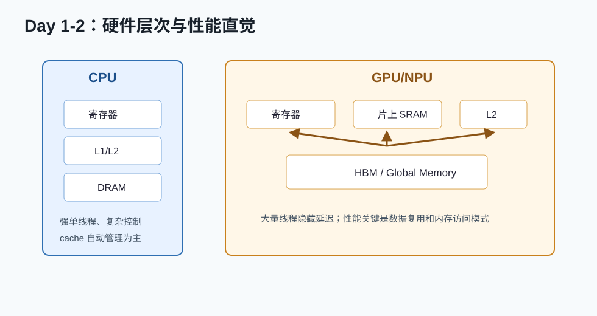

# Day 01：硬件地图与内存层次



## 今天的核心结论

算子优化的第一天，不要急着背 CUDA API。你要先建立一个朴素但非常重要的直觉：

```text
硬件的计算单元很快，但数据从远处搬过来很慢。
优秀 kernel 的本质之一，就是让数据少搬、连续搬、搬来以后多用几次。
```

如果你今天只记住一句话，就记住：**写算子不是把公式翻译成代码，而是把公式安排到硬件的数据通路上。**

## 今天你要完成什么

最低 2 小时版：

1. 看懂 CPU 与 GPU/NPU 的内存层次差异。
2. 能解释 register、shared memory、global memory/HBM。
3. 能解释 grid、block、thread、warp 的基本关系。
4. 写一页自己的硬件地图笔记。

完整版 4-6 小时：

1. 精读 CUDA Programming Guide 的 programming model 与 memory hierarchy。
2. 浏览 CUDA Best Practices Guide 的目录。
3. 对比 CUDA/HIP/Ascend/BANG C 这些生态里相似概念。
4. 做一张“术语映射表”。

## 必读资料与读法

### 资料 1：CUDA C++ Programming Guide

链接：[CUDA C++ Programming Guide](https://docs.nvidia.com/cuda/cuda-c-programming-guide/index.html)  
可靠性：A，NVIDIA 官方文档。

读法：

- 只读 `Programming Model`。
- 只读 `Memory Hierarchy`。
- 只读 kernel launch 和 thread hierarchy 相关小节。

你今天不需要读：

- texture memory。
- cooperative groups 复杂用法。
- inline PTX。
- dynamic parallelism。

### 资料 2：CUDA C++ Best Practices Guide

链接：[CUDA C++ Best Practices Guide](https://docs.nvidia.com/cuda/cuda-c-best-practices-guide/index.html)  
可靠性：A，NVIDIA 官方优化手册。

今天只做目录扫描，圈出这些词：

- memory coalescing
- shared memory
- occupancy
- bandwidth
- profiling

目录扫描的意义是：你先知道“遇到问题去哪查”，不要求今天都理解。

### 资料 3：AMD HIP 文档

链接：[HIP Documentation](https://rocmdocs.amd.com/projects/HIP/en/latest/index.html)  
可靠性：A，AMD 官方文档。

读法：

- 只看 HIP 是什么。
- 知道 CUDA 概念大体可以迁移到 HIP。
- 先别深入 API 差异。

## 概念讲解：CPU 和 GPU/NPU 的性格差异

CPU 像一个很聪明、很灵活、单人能力强的工程师。它擅长复杂控制流、分支、低延迟任务、操作系统调度。

GPU/NPU 像一个巨大的流水线工厂。每个工人单独看并不强，但人数多、吞吐高，前提是你给它安排整齐、重复、数据并行的工作。

所以：

- CPU 喜欢复杂逻辑。
- GPU/NPU 喜欢大批量相似计算。
- CPU 的 cache 很强，很多事情硬件帮你兜底。
- GPU/NPU 上你常常要主动安排数据怎么搬、怎么复用。

## 概念讲解：内存层次

### Register

register 是线程私有的最快存储。它快，但数量有限。

你需要知道：

- 每个线程有自己的寄存器。
- 寄存器用多了会降低 occupancy。
- 寄存器不够时可能 spill 到 local memory，性能会掉。

新人常见误解：

```text
寄存器越多越好。
```

更准确的说法：

```text
寄存器能减少访存，但寄存器太多会降低并发度，还可能 spill。
```

### Shared Memory / SRAM

shared memory 是 block 内线程共享的片上高速存储。它的价值不是“容量大”，而是“近、快、可控”。

典型用途：

- 矩阵转置中改变访问模式。
- GEMM 中缓存 A/B tile。
- reduction 中保存部分和。

要点：

- block 内共享，block 之间不共享。
- 通常要 `__syncthreads()`。
- 可能有 bank conflict。

### Global Memory / HBM

global memory 是显存/HBM，容量大、带宽高，但延迟远高于寄存器和 shared memory。

优化目标：

- 少读写。
- 连续读写。
- 合并读写。
- 读进来以后多复用。

## 概念讲解：线程层级

CUDA 的常见层级：

```text
Grid
  Block
    Thread
```

实际调度里还有 warp：

```text
Warp = 一组一起执行的线程，NVIDIA 常见是 32 个线程。
```

你可以先这样记：

- grid 是整个任务。
- block 是任务切成的块。
- thread 是块里的工作者。
- warp 是硬件真正喜欢一起调度的一小队线程。

## 手写笔记模板

今天新建 `day01_hardware_notes.md`，照下面填：

```text
# Day 01 硬件地图

## 1. 我理解的 CPU

## 2. 我理解的 GPU/NPU

## 3. 三种存储

register:
shared memory / SRAM:
global memory / HBM:

## 4. 线程层级

grid:
block:
thread:
warp:

## 5. 今天最重要的一句话

## 6. 我还不懂的 5 个问题
```

## 小练习

练习 1：用自己的话解释这句话：

```text
GPU 的 global memory 带宽很高，但仍然要尽量少访问 global memory。
```

参考方向：

- 带宽高不等于无限。
- 延迟依然大。
- 同一份数据从 HBM 搬来后，如果只用一次就丢，很浪费。
- 片上复用能显著提高有效吞吐。

练习 2：给下面的存储按速度排序：

```text
register, shared memory, L2, global memory
```

一般直觉：

```text
register > shared memory > L2 > global memory
```

但真实性能还取决于访问模式、缓存命中、bank conflict、并发度。

练习 3：把这些词写成一句完整的话：

```text
grid, block, thread, global index
```

参考答案：

```text
一个 grid 由多个 block 组成，一个 block 由多个 thread 组成；一维情况下，全局元素下标可以用 blockIdx.x * blockDim.x + threadIdx.x 计算。
```

## 自测题

1. shared memory 是所有 block 共享的吗？
2. register 是线程私有的吗？
3. global memory 容量通常比 shared memory 大还是小？
4. GPU 为什么要很多线程？
5. coalescing 大概是什么意思？

参考答案：

1. 不是，通常是 block 内共享。
2. 是。
3. 大很多。
4. 用大量线程隐藏访存延迟，并提供吞吐。
5. 相邻线程访问连续地址，让硬件合并成更高效的内存事务。

## 今天的验收标准

你合格了，如果你能对别人说清楚：

```text
GPU kernel 慢不一定是公式复杂，很多时候是数据访问模式差。register/shared/global memory 的距离不同，访问代价不同，所以算子优化要围绕数据怎么搬、怎么复用来设计。
```

