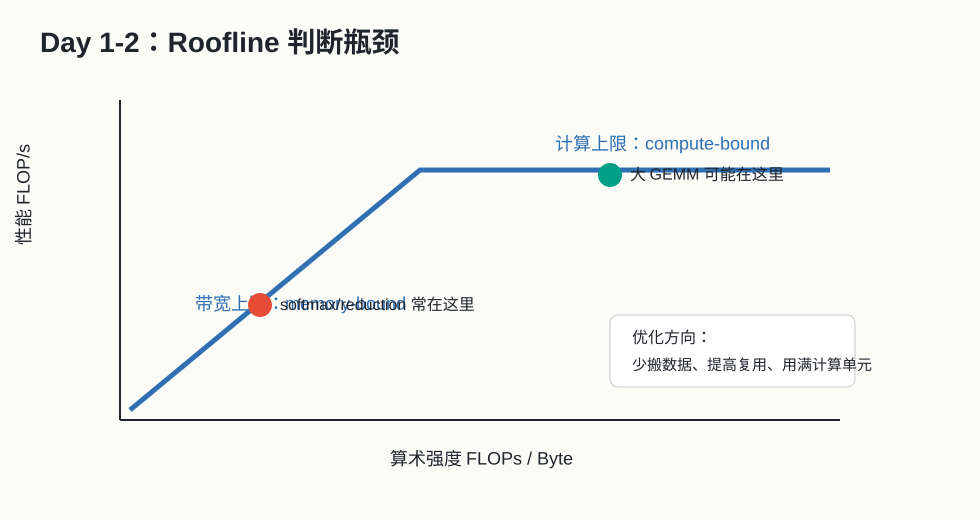

# Day 02：Roofline 与性能瓶颈判断



## 今天的核心结论

今天你要学会用一个简单模型判断：

```text
这个算子主要是卡在算不动，还是卡在搬不动？
```

这句话会贯穿你以后所有算子优化工作。真正成熟的优化不是“凭感觉改参数”，而是先判断瓶颈，再选择动作。

## 今天你要完成什么

最低 2 小时版：

1. 读 [Roofline 中文讲解](../paper_notes/01_Roofline_中文讲解.md)。
2. 理解算术强度 `FLOPs / Byte`。
3. 给 vector add、softmax、GEMM 做初步瓶颈判断。

完整版 4-6 小时：

1. 浏览本地 PDF：[Roofline Model](../papers/01_Roofline_EECS-2008-134.pdf)。
2. 阅读 NVIDIA matrix multiplication 文档里的算术强度部分。
3. 给 6 个常见算子估算读写量和计算量。
4. 写一份 `day02_roofline_worksheet.md`。

## 必读资料与读法

### 资料 1：Roofline 论文中文讲解

本地文件：[Roofline 中文讲解](../paper_notes/01_Roofline_中文讲解.md)  
本地 PDF：[Roofline Model](../papers/01_Roofline_EECS-2008-134.pdf)

读法：

- 先读中文讲解。
- PDF 只看图和 introduction。
- 不要卡在每个实验细节。

### 资料 2：NVIDIA Matrix Multiplication Background

链接：[Matrix Multiplication Background](https://docs.nvidia.com/deeplearning/performance/dl-performance-matrix-multiplication/index.html)  
可靠性：A。

读法：

- 看 GEMM 的 M/N/K 定义。
- 看 arithmetic intensity。
- 先不深入 Tensor Core 细节，Day 11 再回来读。

## 概念讲解：算术强度

公式：

```text
Arithmetic Intensity = FLOPs / Bytes
```

它表示：

```text
每从内存搬 1 byte 数据，可以做多少次计算。
```

算术强度低：

- 数据搬来只算一两下。
- 常见于 elementwise、copy、transpose。
- 优化重点是内存访问。

算术强度高：

- 数据搬来后反复用。
- 常见于大 GEMM。
- 有机会接近计算峰值。

## 例子 1：Vector Add

计算：

```text
c[i] = a[i] + b[i]
```

每个元素：

- 读 `a[i]`：4 bytes，假设 FP32。
- 读 `b[i]`：4 bytes。
- 写 `c[i]`：4 bytes。
- 做 1 次加法。

粗略算术强度：

```text
1 FLOP / 12 Bytes = 0.083 FLOPs/Byte
```

这非常低，所以 vector add 通常是 memory-bound。

## 例子 2：Softmax

一行 softmax：

```text
y_i = exp(x_i - max(x)) / sum_j exp(x_j - max(x))
```

它有：

- max reduction。
- exp。
- sum reduction。
- division。

计算比 vector add 多，但读写也很多。如果拆成多个 kernel，中间结果会反复写回 HBM：

```text
max kernel
exp kernel
sum kernel
div kernel
```

所以 softmax 常见优化方向是 fusion：把中间值尽量留在寄存器或片上。

## 例子 3：GEMM

计算：

```text
C[M,N] = A[M,K] @ B[K,N]
```

每个 C 元素需要 K 次乘加。A/B 元素可以被多个 C 元素复用。

如果 tiling 做得好：

- A tile 搬进 shared memory。
- B tile 搬进 shared memory。
- 多个线程反复使用这些 tile。

所以 GEMM 算术强度高，是最有希望接近计算峰值的算子之一。

## 工作中怎么用 Roofline

拿到一个慢算子时，你可以按这个流程：

1. 写出输入输出 shape。
2. 估算读了多少 byte。
3. 估算写了多少 byte。
4. 估算大概 FLOPs。
5. 算 FLOPs/Byte。
6. 判断更像 memory-bound 还是 compute-bound。
7. 用 profiler 验证猜测。

## 练习：给常见算子做瓶颈分类

填表：

| 算子 | 计算量直觉 | 数据搬运直觉 | 初步分类 | 优化优先级 |
|---|---|---|---|---|
| copy | 极低 | 高 | memory-bound | 连续访问、带宽 |
| vector add | 低 | 高 | memory-bound | coalescing、vectorized load |
| transpose | 低 | 高且访问模式差 | memory-bound | shared memory tile |
| softmax | 中等 | 多次读写 | memory/reduction | fusion、row-wise reduction |
| layernorm | 中等 | 多次读写 | memory/reduction | fusion、FP32 accumulate |
| GEMM | 高 | 可复用 | compute 或 mixed | tiling、Tensor Core |

## 今天的输出模板

创建 `day02_roofline_worksheet.md`：

```text
# Day 02 Roofline Worksheet

## 1. 算术强度定义

## 2. 三个例子

### vector add
读写:
计算:
瓶颈判断:

### softmax
读写:
计算:
瓶颈判断:

### GEMM
读写:
计算:
瓶颈判断:

## 3. 我以后优化前要先问的问题

1.
2.
3.
```

## 自测题

1. 算术强度的分子和分母分别是什么？
2. vector add 为什么通常是 memory-bound？
3. GEMM 为什么有机会 compute-bound？
4. fusion 为什么能帮助 softmax？
5. Roofline 是精确性能预测模型，还是上限/方向判断模型？

参考答案：

1. FLOPs 和 Bytes。
2. 每个元素计算太少，读写不少。
3. A/B 数据能被复用很多次。
4. 减少中间结果写回和再次读出。
5. 更像上限和方向判断模型。

## 今天的验收标准

你能把下面这段话讲明白：

```text
算子优化前，我会先估算算术强度。如果 FLOPs/Byte 很低，我优先看内存访问和中间结果；如果很高，我再看计算单元是否用满、Tensor Core 是否启用、寄存器和 occupancy 是否合适。
```

