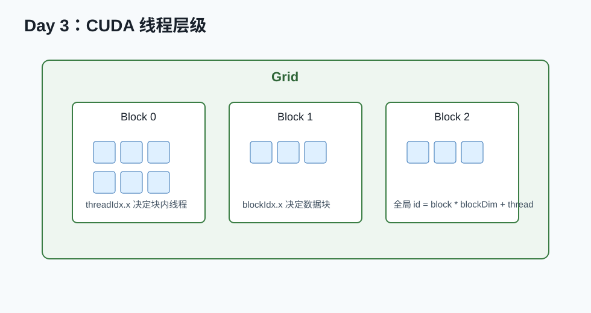

# Day 03：Vector Add 与正确计时



## 今天的核心结论

今天你写第一个 kernel。它很简单，但它会暴露 80% 新人都会踩的基础坑：

- 全局下标算错。
- 边界条件漏掉。
- GPU 异步执行导致计时不准。
- 没做 correctness check。
- benchmark 没 warmup。

你今天的目标不是“写出惊艳性能”，而是建立一个正确的 kernel 实验闭环。

## 今天你要完成什么

最低 2 小时版：

1. 写出 vector add kernel。
2. 和 CPU/PyTorch reference 对齐。
3. 用同步或 event 正确计时。

完整版 4-6 小时：

1. 测多个 `N`。
2. 测多个 block size。
3. 计算有效带宽。
4. 写一份 benchmark 表。

## 必读资料与读法

1. [CUDA C++ Programming Guide](https://docs.nvidia.com/cuda/cuda-c-programming-guide/index.html)  
   读 kernel、thread hierarchy、execution configuration。
2. [CUDA Runtime API Event Management](https://docs.nvidia.com/cuda/cuda-runtime-api/group__CUDART__EVENT.html)  
   读 `cudaEventRecord`、`cudaEventSynchronize`、`cudaEventElapsedTime`。
3. [CUDA Best Practices Guide](https://docs.nvidia.com/cuda/cuda-c-best-practices-guide/index.html)  
   看 timing 和 memory throughput 相关内容。

## 概念讲解：为什么 GPU 计时容易错

GPU kernel launch 通常是异步的。也就是说：

```text
CPU 发起 kernel launch 后，可能马上继续往下走；
此时 GPU kernel 还没真正跑完。
```

错误计时：

```cpp
auto t0 = now();
vector_add<<<grid, block>>>(...);
auto t1 = now();
```

这测到的可能主要是 launch 开销，不是 kernel 执行时间。

正确方向：

- 用 CUDA event。
- 或在计时结束前 `cudaDeviceSynchronize()`。

## CUDA kernel 代码骨架

```cpp
__global__ void vector_add_kernel(
    const float* a,
    const float* b,
    float* c,
    int n
) {
    int idx = blockIdx.x * blockDim.x + threadIdx.x;
    if (idx < n) {
        c[idx] = a[idx] + b[idx];
    }
}
```

关键解释：

- `blockIdx.x`：当前 block 编号。
- `blockDim.x`：每个 block 有多少 thread。
- `threadIdx.x`：当前 thread 在 block 内编号。
- `idx`：这个 thread 负责的全局元素位置。
- `idx < n`：处理最后一个 block 不满的情况。

## launch 参数

常见写法：

```cpp
int block = 256;
int grid = (n + block - 1) / block;
vector_add_kernel<<<grid, block>>>(a, b, c, n);
```

为什么要向上取整：

```text
n = 1000, block = 256
如果 grid = n / block = 3，只能覆盖 768 个元素。
如果 grid = (n + block - 1) / block = 4，可以覆盖 1024 个位置，再靠 idx < n 过滤越界。
```

## 正确性检查

最简单的检查：

```cpp
for (int i = 0; i < n; ++i) {
    float ref = h_a[i] + h_b[i];
    if (fabs(h_c[i] - ref) > 1e-5) {
        printf("mismatch at %d\n", i);
        break;
    }
}
```

真实工程里要测：

- `n = 0` 或很小。
- `n` 不是 block size 整数倍。
- 大 `n`。
- 随机输入。
- 特殊值：0、负数、大数。

## 计时代码骨架

```cpp
cudaEvent_t start, stop;
cudaEventCreate(&start);
cudaEventCreate(&stop);

// warmup
for (int i = 0; i < 10; ++i) {
    vector_add_kernel<<<grid, block>>>(d_a, d_b, d_c, n);
}
cudaDeviceSynchronize();

cudaEventRecord(start);
for (int i = 0; i < repeat; ++i) {
    vector_add_kernel<<<grid, block>>>(d_a, d_b, d_c, n);
}
cudaEventRecord(stop);
cudaEventSynchronize(stop);

float ms = 0.0f;
cudaEventElapsedTime(&ms, start, stop);
float avg_ms = ms / repeat;
```

## 有效带宽计算

FP32 vector add 每个元素大约：

- 读 a：4 bytes
- 读 b：4 bytes
- 写 c：4 bytes

所以：

```text
bytes = n * 12
bandwidth = bytes / time
```

注意单位换算：

```text
GB/s = bytes / seconds / 1e9
```

## 实验表

| N | block size | avg ms | GB/s | correct |
|---:|---:|---:|---:|---|
| 1024 | 128 | | | |
| 1024 | 256 | | | |
| 1024 | 512 | | | |
| 1048576 | 128 | | | |
| 1048576 | 256 | | | |
| 1048576 | 512 | | | |

## 常见错误排查

### 输出全是 0

可能原因：

- kernel 没 launch 成功。
- 没 copy device -> host。
- 输入没 copy host -> device。
- `idx` 算错。

检查：

```cpp
cudaError_t err = cudaGetLastError();
printf("kernel error: %s\n", cudaGetErrorString(err));
```

### 最后几个元素错

可能原因：

- grid 没向上取整。
- 没有 `idx < n`。

### 时间特别小

可能原因：

- 没同步。
- 只测了 launch。

### 小 N 性能很差

正常现象。小任务 launch overhead 占比很大。

## 自测题

1. 为什么要 `idx < n`？
2. 为什么 grid 要向上取整？
3. 为什么 GPU 计时要同步？
4. vector add 为什么通常 memory-bound？
5. 有效带宽包含 host-device copy 吗？

参考答案：

1. 防止最后一个 block 越界。
2. 覆盖所有元素。
3. kernel 异步执行。
4. 每个元素计算少、读写多。
5. 通常 kernel benchmark 不包含，只算 device memory 读写。

## 今天的验收标准

你今天合格，如果你能拿出：

```text
vector_add.cu
正确性检查结果
至少 6 行 benchmark 表
一段解释：为什么 vector add 主要看带宽
```

