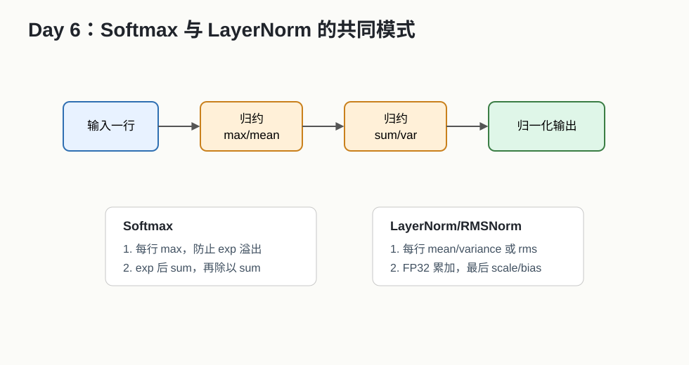

# Day 06：Softmax、LayerNorm 与数值稳定



## 今天的核心结论

今天你写第一个真正像深度学习框架里的算子：softmax 和 layernorm/rmsnorm。

这一天的重点不是“公式会背”，而是：

```text
如何把公式拆成 reduction + elementwise，
如何保证数值稳定，
如何减少中间结果写回。
```

## 今天你要完成什么

最低 2 小时版：

1. 写出 stable softmax 的 Python/PyTorch reference。
2. 写出 RMSNorm 或 LayerNorm 的 reference。
3. 列出输入输出 shape、dtype、误差标准。

完整版 4-6 小时：

1. 实现 CUDA 或 Triton softmax forward。
2. 实现 CUDA 或 Triton RMSNorm forward。
3. 做 correctness test 和 shape sweep。

## 必读资料与读法

1. [Triton Fused Softmax Tutorial](https://triton-lang.org/main/getting-started/tutorials/02-fused-softmax.html)  
   可靠性：A。今天重点看算法结构。
2. [Triton Layer Normalization Tutorial](https://triton-lang.org/main/getting-started/tutorials/05-layer-norm.html)  
   可靠性：A。先看 forward。
3. [PyTorch Softmax](https://docs.pytorch.org/docs/stable/generated/torch.nn.functional.softmax.html)  
   可靠性：A。
4. [PyTorch LayerNorm](https://docs.pytorch.org/docs/stable/generated/torch.nn.LayerNorm.html)  
   可靠性：A。

## Softmax 公式

朴素公式：

```text
softmax(x_i) = exp(x_i) / sum_j exp(x_j)
```

稳定公式：

```text
m = max_j x_j
softmax(x_i) = exp(x_i - m) / sum_j exp(x_j - m)
```

为什么可以减最大值？

```text
分子分母同时乘以 exp(-m)，结果不变。
```

为什么必须这么做？

```text
如果 x_i 很大，exp(x_i) 可能溢出成 Inf。
减最大值后，最大元素变成 0，exp(0)=1，更稳定。
```

## Softmax 的计算步骤

对每一行：

1. 求 max。
2. 每个元素减 max。
3. 求 exp。
4. 求 exp 的 sum。
5. 每个元素除以 sum。

这意味着：

```text
softmax = reduction(max) + elementwise(exp) + reduction(sum) + elementwise(div)
```

## Softmax 参考实现

```python
def stable_softmax_ref(x, dim=-1):
    m = x.max(dim=dim, keepdim=True).values
    z = x - m
    numerator = torch.exp(z)
    denominator = numerator.sum(dim=dim, keepdim=True)
    return numerator / denominator
```

## LayerNorm 公式

对一行 hidden vector：

```text
mean = sum(x_i) / N
var = sum((x_i - mean)^2) / N
y_i = (x_i - mean) / sqrt(var + eps) * weight_i + bias_i
```

常见点：

- mean/var 用 FP32 累加。
- eps 加在 sqrt 前。
- weight/bias shape 通常是 hidden size。

## RMSNorm 公式

RMSNorm 比 LayerNorm 少了 mean：

```text
rms = sqrt(mean(x_i^2) + eps)
y_i = x_i / rms * weight_i
```

LLM 里经常见 RMSNorm。

## RMSNorm 参考实现

```python
def rms_norm_ref(x, weight, eps=1e-6):
    orig_dtype = x.dtype
    x_float = x.float()
    variance = x_float.pow(2).mean(dim=-1, keepdim=True)
    y = x_float * torch.rsqrt(variance + eps)
    y = y.to(orig_dtype) * weight
    return y
```

## 测试 shape

| batch/rows | hidden/cols | 场景 |
|---:|---:|---|
| 1 | 128 | 小输入 |
| 32 | 768 | BERT 类 hidden |
| 128 | 1024 | 常规 hidden |
| 64 | 4096 | LLM hidden |
| 16 | 8192 | 大 hidden |

## 误差标准建议

| dtype | rtol | atol |
|---|---:|---:|
| FP32 | 1e-5 | 1e-6 |
| FP16 | 1e-2 | 1e-3 |
| BF16 | 2e-2 | 2e-2 |

这只是学习建议。真实项目以团队标准为准。

## correctness 测试模板

```python
def check_close(name, out, ref, rtol, atol):
    max_abs = (out - ref).abs().max().item()
    ok = torch.allclose(out, ref, rtol=rtol, atol=atol)
    print(name, "ok=", ok, "max_abs=", max_abs)
```

要测：

- 正常随机输入。
- 大正数。
- 大负数。
- 全 0。
- hidden size 不是 2 的幂。
- non-contiguous 输入，如果你的实现声称支持。

## 性能优化直觉

### 为什么 fused softmax 可能快

拆开写：

```text
kernel1: max
kernel2: subtract + exp
kernel3: sum
kernel4: divide
```

会产生中间结果读写和多次 launch。

融合写：

```text
一个 kernel 内完成一行 softmax，
中间值尽量放在寄存器或片上。
```

收益：

- 少 launch。
- 少 HBM 中间读写。

### 为什么 hidden size 重要

hidden size 小：

- launch overhead 可能明显。
- 一个 block 处理一行可能线程利用率不高。

hidden size 大：

- 一个 block 未必足够。
- 寄存器和 shared memory 压力上升。
- 可能需要分块归约。

## 常见错误排查

### softmax 出现 NaN/Inf

可能原因：

- 没减 max。
- 输入本身有 Inf。
- denominator 为 0，通常说明前面出现下溢/异常。

### LayerNorm 误差大

可能原因：

- FP16 直接求 mean/var。
- eps 加错位置。
- variance 用了无偏估计，和 PyTorch LayerNorm 语义不同。

### RMSNorm 结果整体比例不对

可能原因：

- 用了 sum 而不是 mean。
- 忘记乘 weight。
- eps 写错。

## 自测题

1. softmax 为什么要减最大值？
2. softmax 需要几次 reduction？
3. LayerNorm 和 RMSNorm 差在哪里？
4. 为什么 norm 类算子常用 FP32 accumulate？
5. fusion 为什么能减少 HBM 压力？

参考答案：

1. 防止 exp 溢出，且结果不变。
2. 通常 max 和 sum 两次。
3. LayerNorm 减 mean 并用 variance，RMSNorm 用平方均值的根。
4. 降低半精度累加误差。
5. 中间结果不用反复写回和读出 global memory。

## 今天的验收标准

你能拿出：

```text
stable_softmax_ref
rmsnorm_ref 或 layernorm_ref
至少 5 组 shape 的 correctness 表
一段解释：softmax/norm 如何由 reduction + elementwise 组成
```

