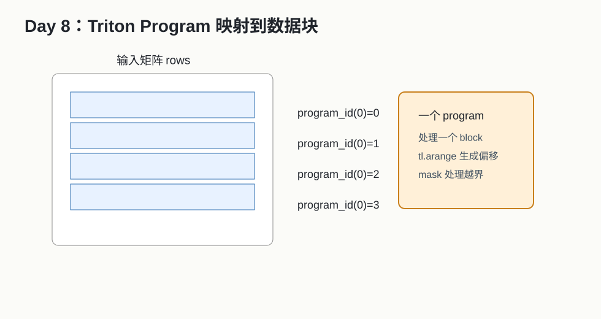

# Day 08：Triton 编程模型入门



## 今天的核心结论

Triton 的价值是让你用更接近张量块的方式写 GPU kernel。

CUDA 的常见心智模型：

```text
我给每个 thread 分配元素。
```

Triton 的常见心智模型：

```text
我给每个 program 分配一个 tile 或一行数据。
```

这对新人很友好，因为你可以更快表达 softmax、layernorm、matmul 这类算子。

## 今天你要完成什么

最低 2 小时版：

1. 读 Triton 中文讲解。
2. 理解 `program_id`、`tl.arange`、`tl.load`、`mask`。
3. 跑通 Triton vector add。

完整版 4-6 小时：

1. 写 Triton fused elementwise。
2. 做 BLOCK_SIZE benchmark。
3. 对比 PyTorch eager。

## 必读资料与读法

1. [Triton Tutorials](https://triton-lang.org/main/getting-started/tutorials/)  
   可靠性：A，官方教程。
2. [Triton Language API](https://triton-lang.org/main/python-api/triton.language.html)  
   可靠性：A，查 API。
3. 本地 PDF：[Triton MAPL 2019](../papers/03_Triton_MAPL2019.pdf)
4. 中文讲解：[Triton 中文讲解](../paper_notes/03_Triton_中文讲解.md)

读法：

- 先读中文讲解。
- 然后看官方 tutorial 的 vector add 或 fused softmax 前半部分。
- API 文档只查你用到的函数，不要从头读。

## Triton 最重要的 6 个词

| 词 | 解释 |
|---|---|
| `@triton.jit` | 把 Python 函数 JIT 编译成 kernel |
| `tl.program_id(axis)` | 当前 program 在某个维度的编号 |
| `tl.arange` | 生成一个 block/tile 内的偏移向量 |
| `tl.load` | 从指针加偏移读数据 |
| `tl.store` | 写数据 |
| `mask` | 边界保护，防止越界读写 |

## Triton vector add 代码骨架

```python
import torch
import triton
import triton.language as tl


@triton.jit
def add_kernel(x_ptr, y_ptr, out_ptr, n_elements, BLOCK_SIZE: tl.constexpr):
    pid = tl.program_id(axis=0)
    block_start = pid * BLOCK_SIZE
    offsets = block_start + tl.arange(0, BLOCK_SIZE)
    mask = offsets < n_elements

    x = tl.load(x_ptr + offsets, mask=mask)
    y = tl.load(y_ptr + offsets, mask=mask)
    out = x + y
    tl.store(out_ptr + offsets, out, mask=mask)


def add(x, y, block_size=1024):
    out = torch.empty_like(x)
    n_elements = out.numel()
    grid = (triton.cdiv(n_elements, block_size),)
    add_kernel[grid](x, y, out, n_elements, BLOCK_SIZE=block_size)
    return out
```

逐行解释：

- `pid`：当前 program 编号。
- `block_start`：这个 program 处理的数据起点。
- `offsets`：这个 program 内所有元素下标。
- `mask`：最后一个 block 可能越界，所以要保护。
- `tl.load`/`tl.store` 一次处理一组元素。

## fused elementwise 练习

实现：

```text
y = relu(x * scale + bias)
```

代码结构：

```python
z = x * scale + bias
y = tl.maximum(z, 0.0)
```

思考：

- 如果拆成 PyTorch 多个 op，可能有多个 kernel 或中间 tensor。
- Triton 一个 kernel 做完，可能减少 launch 和中间写回。

## benchmark 模板

```python
def bench(fn, *args, warmup=25, rep=100):
    for _ in range(warmup):
        fn(*args)
    torch.cuda.synchronize()

    ms = triton.testing.do_bench(lambda: fn(*args), rep=rep)
    return ms
```

注意：

- `do_bench` 会帮你做较规范的计时。
- 仍然要确认输出正确。
- 对小 tensor，Triton 不一定比 PyTorch 快。

## BLOCK_SIZE 怎么想

太小：

- program 太多。
- launch 后调度开销和内存效率可能不好。

太大：

- 寄存器压力大。
- 编译时间可能上升。
- 可能超过硬件/编译器限制。

常见试验：

```text
256, 512, 1024, 2048
```

## 实验表

| N | BLOCK_SIZE | Triton ms | PyTorch ms | correct | 观察 |
|---:|---:|---:|---:|---|---|

## 常见错误排查

### 编译报错说 constexpr

可能原因：

- 某些参数需要在编译期确定，要标成 `tl.constexpr`。

### 输出最后一段错

可能原因：

- mask 写错。
- grid 不是向上取整。

### 性能比 PyTorch 慢

可能原因：

- tensor 太小。
- PyTorch 已经调用高性能实现。
- BLOCK_SIZE 不合适。
- 你的 kernel 做的工作太简单，launch overhead 占比大。

## 自测题

1. Triton program 和 CUDA thread 是同一个概念吗？
2. `tl.arange` 生成标量还是向量？
3. mask 的作用是什么？
4. 为什么 BLOCK_SIZE 不是越大越好？
5. Triton 适合哪些类型的算子？

参考答案：

1. 不是。Triton program 通常处理一个 tile。
2. 向量/块内偏移。
3. 防止越界读写。
4. 会增加资源压力和限制。
5. fused elementwise、row-wise reduction、softmax、norm、中小 matmul 等。

## 今天的验收标准

你能说清：

```text
Triton 让我以 block/tile 为单位写 kernel；program_id 负责定位当前 tile，tl.arange 生成 tile 内偏移，mask 处理边界。
```

