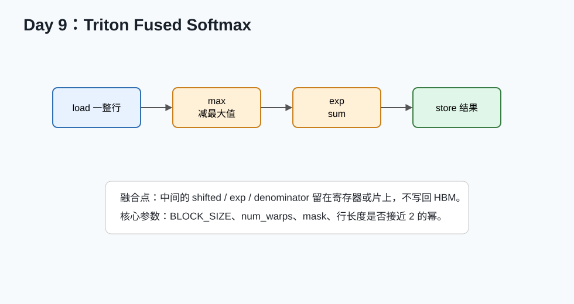

# Day 09：Triton Fused Softmax



## 今天的核心结论

Fused softmax 是理解 Triton 的经典案例。它把多个逻辑步骤放进一个 kernel：

```text
load row -> max -> exp -> sum -> divide -> store
```

中间结果尽量不写回 HBM。这就是“融合”的核心收益。

## 今天你要完成什么

最低 2 小时版：

1. 跑通 Triton 官方 fused softmax。
2. 看懂每行代码。
3. 和 PyTorch softmax 比正确性。

完整版 4-6 小时：

1. 对多个 `n_cols` 做 benchmark。
2. 调 `BLOCK_SIZE`、`num_warps`。
3. 写一页性能分析。

## 必读资料与读法

1. [Triton Fused Softmax Tutorial](https://triton-lang.org/main/getting-started/tutorials/02-fused-softmax.html)  
   可靠性：A，今天主读。
2. [Triton do_bench API](https://triton-lang.org/main/python-api/generated/triton.testing.do_bench.html)  
   可靠性：A。
3. [PyTorch Softmax](https://docs.pytorch.org/docs/stable/generated/torch.nn.functional.softmax.html)  
   可靠性：A。

## softmax 的 row-wise 结构

输入：

```text
X[n_rows, n_cols]
```

输出：

```text
Y[n_rows, n_cols]
```

常见 Triton 设计：

```text
一个 program 处理一行。
```

当 `n_cols` 不太大时，这个设计简单有效。

## 代码骨架

```python
@triton.jit
def softmax_kernel(input_ptr, output_ptr, n_cols, input_stride, output_stride, BLOCK_SIZE: tl.constexpr):
    row_idx = tl.program_id(0)
    row_start_ptr = input_ptr + row_idx * input_stride
    offsets = tl.arange(0, BLOCK_SIZE)
    mask = offsets < n_cols

    row = tl.load(row_start_ptr + offsets, mask=mask, other=-float("inf"))
    row_minus_max = row - tl.max(row, axis=0)
    numerator = tl.exp(row_minus_max)
    denominator = tl.sum(numerator, axis=0)
    softmax_output = numerator / denominator

    output_row_start_ptr = output_ptr + row_idx * output_stride
    tl.store(output_row_start_ptr + offsets, softmax_output, mask=mask)
```

## 逐行讲解

```python
row_idx = tl.program_id(0)
```

当前 program 处理第几行。

```python
offsets = tl.arange(0, BLOCK_SIZE)
```

生成这一行内的一组列偏移。

```python
mask = offsets < n_cols
```

最后一段可能越界，要 mask。

```python
other=-float("inf")
```

越界元素填负无穷，参与 max 时不会影响结果。

```python
row_minus_max = row - tl.max(row, axis=0)
```

数值稳定。

```python
denominator = tl.sum(numerator, axis=0)
```

求一行 exp 的总和。

## 为什么 BLOCK_SIZE 取 2 的幂

Triton 官方教程常用：

```python
BLOCK_SIZE = triton.next_power_of_2(n_cols)
```

原因：

- 某些底层向量化和 reduction 实现更方便。
- 但多出来的位置必须用 mask 保护。

注意：

```text
BLOCK_SIZE 太大也不好，会浪费计算和资源。
```

## benchmark shape

| n_rows | n_cols |
|---:|---:|
| 1024 | 128 |
| 1024 | 256 |
| 1024 | 512 |
| 1024 | 1024 |
| 1024 | 2048 |
| 4096 | 1024 |
| 4096 | 4096 |

## 实验表

| n_rows | n_cols | BLOCK_SIZE | num_warps | PyTorch ms | Triton ms | speedup | max error |
|---:|---:|---:|---:|---:|---:|---:|---:|

## 观察点

看结果时不要只问“谁快”，要问：

- 小 `n_cols` 时 launch overhead 是否明显？
- 大 `n_cols` 时一个 program 是否资源压力过大？
- PyTorch eager 是否已经做了优化？
- `torch.compile` 后结果是否改变？
- Triton 版本是否减少了中间 tensor？

## 常见错误排查

### 输出不是概率分布

检查：

```python
y.sum(dim=-1)
```

应该接近 1。

可能原因：

- denominator 算错。
- mask 的 other 值不对。
- 维度处理错。

### 结果有 NaN

可能原因：

- 没减 max。
- 输入含 NaN。
- denominator 为 0。

### 大列数编译失败或性能很差

可能原因：

- BLOCK_SIZE 太大。
- 一个 program 处理一行不再合适。
- 需要分块 softmax 或更复杂实现。

## 自测题

1. fused softmax 融合了哪些步骤？
2. 越界位置为什么填 `-inf`？
3. 为什么要减最大值？
4. 一个 program 处理一行有什么限制？
5. Triton softmax 为什么可能减少 HBM 访问？

参考答案：

1. load、max、exp、sum、divide、store。
2. 不影响 max 和 exp 后的有效值。
3. 防止 exp 溢出。
4. 行太长会资源压力大。
5. 中间结果不必写回全局内存。

## 今天的验收标准

你能说清：

```text
Triton fused softmax 的关键是一个 program 处理一行，在寄存器/片上完成 max、exp、sum 和归一化，减少多个 kernel 和中间 HBM 读写。
```

