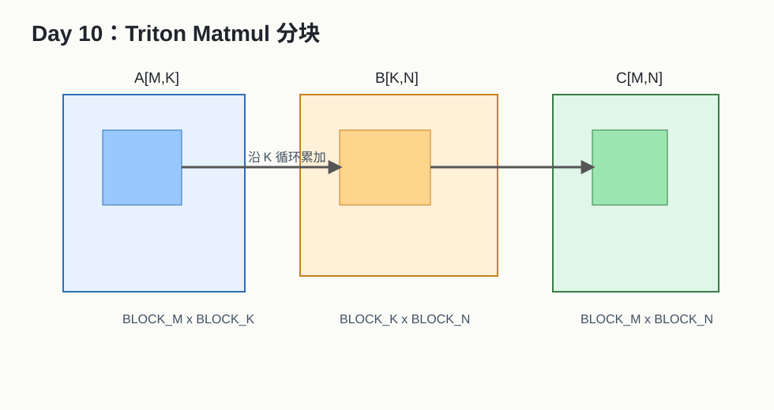

# Day 10：Triton Matmul 与 LayerNorm



## 今天的核心结论

今天你开始接触两个高频方向：

- matmul：高计算密度、分块复用、性能优化核心战场。
- layernorm：row-wise reduction + elementwise，LLM/CV 模型里非常常见。

Triton matmul 的核心心智模型：

```text
一个 program 负责 C 矩阵的一个 tile；
沿 K 维循环加载 A/B tile；
在 accumulator 里累加；
最后写回 C tile。
```

## 今天你要完成什么

最低 2 小时版：

1. 阅读 Triton matmul 教程。
2. 理解 `BLOCK_M`、`BLOCK_N`、`BLOCK_K`。
3. 跑通官方 matmul。

完整版 4-6 小时：

1. 对 3-5 组 shape 做 benchmark。
2. 调 block 参数。
3. 跑通 Triton LayerNorm forward。

## 必读资料与读法

1. [Triton Matrix Multiplication Tutorial](https://triton-lang.org/main/getting-started/tutorials/03-matrix-multiplication.html)  
   可靠性：A，今天主读。
2. [Triton Layer Normalization Tutorial](https://triton-lang.org/main/getting-started/tutorials/05-layer-norm.html)  
   可靠性：A。
3. [NVIDIA Matrix Multiplication Background](https://docs.nvidia.com/deeplearning/performance/dl-performance-matrix-multiplication/index.html)  
   可靠性：A。

## Matmul 公式

```text
C[M, N] = A[M, K] @ B[K, N]
C[m, n] = sum_{k=0}^{K-1} A[m, k] * B[k, n]
```

如果每个线程只算一个 C 元素，会重复从 global memory 读取 A/B。

分块的目标：

```text
A 的一小块和 B 的一小块被搬进来后，尽可能被 C tile 中多个元素复用。
```

## 三个 block 参数

| 参数 | 含义 |
|---|---|
| `BLOCK_M` | C tile 的行数 |
| `BLOCK_N` | C tile 的列数 |
| `BLOCK_K` | 每次沿 K 维累加的块大小 |

直觉：

```text
BLOCK_M x BLOCK_N 决定一个 program 产出多大 C tile。
BLOCK_K 决定每轮加载多少 A/B 数据。
```

## accumulator 为什么常用 FP32

FP16/BF16 输入时，如果用半精度累加，误差可能很大。

常见做法：

```text
输入 FP16/BF16，乘法走低精度路径，accumulator 用 FP32。
```

最后再 cast 到输出 dtype。

## Matmul benchmark shape

| M | N | K | 场景 |
|---:|---:|---:|---|
| 512 | 512 | 512 | 小型正方形 |
| 1024 | 1024 | 1024 | 标准 |
| 4096 | 4096 | 4096 | 大 GEMM |
| 1 | 4096 | 4096 | GEMV/小 batch |
| 128 | 4096 | 11008 | LLM MLP 类 |

注意：

```text
不同 shape 的最优策略可能完全不同。
```

## LayerNorm forward 结构

对每一行：

```text
mean = sum(x) / N
var = sum((x - mean)^2) / N
y = (x - mean) / sqrt(var + eps) * weight + bias
```

Triton 常见设计：

```text
一个 program 处理一行；
tl.load 一整行或一块；
tl.sum 求 mean 和 variance；
tl.store 输出。
```

## 动手任务

任务 1：跑 matmul tutorial。

记录：

```text
BLOCK_M, BLOCK_N, BLOCK_K, num_warps, num_stages
```

任务 2：和 PyTorch 比。

```python
ref = torch.matmul(a, b)
out = triton_matmul(a, b)
torch.testing.assert_close(out, ref, rtol=..., atol=...)
```

任务 3：跑 LayerNorm forward。

至少测：

```text
hidden = 768, 1024, 4096, 8192
```

## 实验表

| M | N | K | Triton ms | torch ms | TFLOPS | max error | 观察 |
|---:|---:|---:|---:|---:|---:|---:|---|

TFLOPS 估算：

```text
FLOPs = 2 * M * N * K
TFLOPS = FLOPs / seconds / 1e12
```

## 常见错误排查

### matmul 结果错

可能原因：

- stride 写错。
- mask 写错。
- K 维循环边界错。
- A/B 是否转置理解错。

### 性能很差

可能原因：

- block 参数不合适。
- 没用到高效矩阵指令路径。
- shape 不适合当前实现。
- PyTorch/cuBLAS baseline 太强，手写版本追不上很正常。

### LayerNorm 误差大

可能原因：

- FP32 accumulate 没做。
- variance 公式不一致。
- eps 位置不一致。

## 自测题

1. `BLOCK_M/N/K` 分别控制什么？
2. GEMM FLOPs 为什么是 `2*M*N*K`？
3. 为什么 matmul 输入低精度时也常用 FP32 accumulator？
4. Triton matmul 为什么不一定比 cuBLAS 快？
5. LayerNorm 和 softmax 的共同结构是什么？

参考答案：

1. C tile 行、列，以及每轮 K 维累加块。
2. 每个乘加算约 2 FLOPs。
3. 减少累加误差。
4. cuBLAS 是高度优化库，覆盖大量硬件路径。
5. 都是 row-wise reduction + elementwise。

## 今天的验收标准

你能说清：

```text
Triton matmul 的核心是 C tile 分块和 K 维循环累加；LayerNorm 的核心是每行 mean/variance reduction，并用 FP32 保证数值稳定。
```

