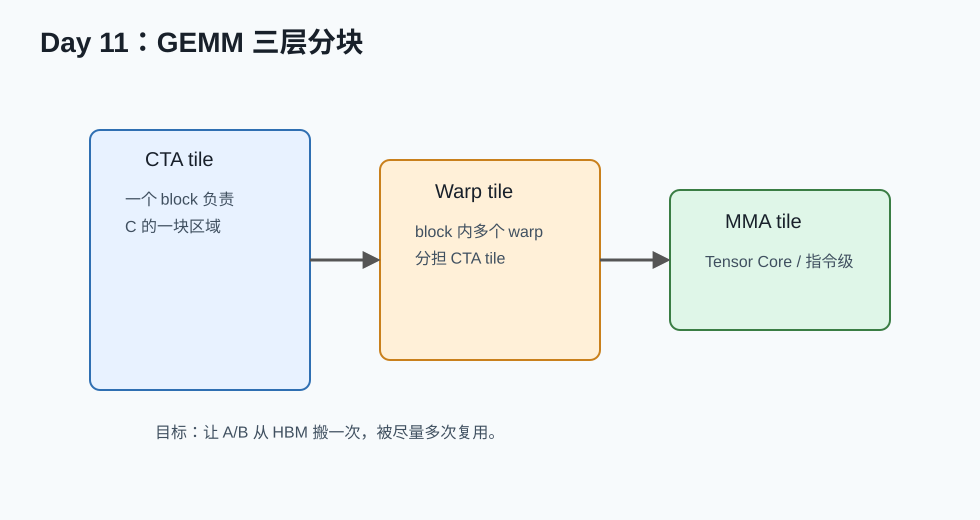

# Day 11：GEMM、Tensor Core 与分块



## 今天的核心结论

GEMM 是算子优化的中心战场。很多深度学习层最后都会落成 GEMM 或 GEMM-like 计算：

- Linear。
- MLP。
- Attention 里的 QK、PV。
- Conv 的 implicit GEMM。
- 量化 matmul。

今天你不需要写出工业级 GEMM，但要理解：

```text
GEMM 快的关键是分块复用和矩阵乘专用硬件。
```

## 今天你要完成什么

最低 2 小时版：

1. 读 NVIDIA matrix multiplication 文档。
2. 读 CUTLASS Efficient GEMM 的分层图。
3. 能解释 CTA tile、warp tile、instruction tile。

完整版 4-6 小时：

1. 写 naive GEMM。
2. 写 shared memory tiled GEMM。
3. 和 PyTorch/cuBLAS 比较。
4. 写 GEMM 学习报告。

## 必读资料与读法

1. [NVIDIA Matrix Multiplication Background](https://docs.nvidia.com/deeplearning/performance/dl-performance-matrix-multiplication/index.html)  
   可靠性：A，今天主读。
2. [CUTLASS Efficient GEMM in CUDA](https://docs.nvidia.com/cutlass/latest/media/docs/cpp/efficient_gemm.html)  
   可靠性：A。
3. [CUDA Programming Guide](https://docs.nvidia.com/cuda/cuda-c-programming-guide/index.html)  
   可靠性：A。选读 WMMA/Tensor Core 相关章节。

## GEMM 为什么重要

公式：

```text
C = A @ B
```

每个 C 元素：

```text
C[m,n] = sum_k A[m,k] * B[k,n]
```

同一个 A 元素会被多个 N 使用，同一个 B 元素会被多个 M 使用。这种复用让 GEMM 的算术强度很高。

## naive GEMM 心智模型

```cpp
for m in M:
  for n in N:
    acc = 0
    for k in K:
      acc += A[m,k] * B[k,n]
    C[m,n] = acc
```

问题：

- A/B 重复从 global memory 读。
- 数据复用没有用好。
- 不一定使用 Tensor Core。

## tiled GEMM 心智模型

```text
把 C 切成 tile。
为了计算一个 C tile，需要一系列 A tile 和 B tile。
A/B tile 先搬到 shared memory。
block 内线程重复使用这些 tile。
```

这就是：

```text
多搬一次到片上，换来很多次复用。
```

## 三层分块

### CTA tile

一个 thread block/CTA 负责 C 的一块区域。

例如：

```text
128 x 128 C tile
```

### Warp tile

CTA 内多个 warp 分摊这个 C tile。

### Instruction tile / MMA tile

硬件矩阵乘指令处理的小 tile。

例如 Tensor Core 上常见的 MMA 形状，具体取决于架构和 dtype。

## Tensor Core 直觉

Tensor Core 是专门做小矩阵乘加的硬件单元。

你可以先这样理解：

```text
普通 CUDA core 做标量/向量 FMA；
Tensor Core 做矩阵块级 MMA，吞吐高很多。
```

使用 Tensor Core 通常需要：

- 合适 dtype：FP16、BF16、TF32、FP8、INT8 等，视硬件而定。
- 合适 layout/alignment。
- 合适矩阵尺寸。
- 调用 cuBLAS/CUTLASS/Triton 或 WMMA/MMA 路径。

## epilogue 是什么

GEMM 主循环算出 accumulator 后，往往还要做：

- 加 bias。
- activation：ReLU/GELU。
- scale。
- residual add。
- cast dtype。

这些叫 epilogue。

epilogue fusion 的价值：

```text
避免 C 写回后又被下一个 kernel 读出做 bias/activation。
```

## 动手任务

任务 1：naive GEMM。

```text
一个 thread 计算一个 C 元素。
```

任务 2：tiled GEMM。

```text
shared memory 存 A tile 和 B tile。
每个 block 计算一个 C tile。
```

任务 3：性能对比。

| M | N | K | naive ms | tiled ms | torch/cuBLAS ms | 观察 |
|---:|---:|---:|---:|---:|---:|---|

## 常见错误排查

### tiled GEMM 结果错

可能原因：

- shared memory tile 索引错。
- K 维最后一个 tile 边界错。
- 少 `__syncthreads()`。
- row-major/column-major 搞反。

### tiled GEMM 比 naive 还慢

可能原因：

- tile 参数太差。
- shared memory 使用不当。
- 小 shape 上开销占比大。
- 编译优化没开。

### 和 PyTorch 差距巨大

正常。PyTorch 通常调用 cuBLAS/cuBLASLt，高度优化。学习阶段目标是理解差距来自哪里。

## 自测题

1. GEMM 为什么算术强度高？
2. CTA tile、warp tile、instruction tile 分别是什么？
3. Tensor Core 和普通 CUDA core 的直觉区别是什么？
4. epilogue fusion 有什么价值？
5. 为什么手写 GEMM 很难超过 cuBLAS？

参考答案：

1. A/B 数据可被多次复用。
2. block 级、warp 级、硬件指令级分块。
3. Tensor Core 做矩阵块 MMA，吞吐更高。
4. 减少额外 kernel 和 HBM 读写。
5. cuBLAS 长期针对硬件深度优化。

## 今天的验收标准

你能说清：

```text
GEMM 优化的核心是把 A/B 数据分块搬到片上并反复复用，再尽量走 Tensor Core/MMA 路径；主计算后的 bias/activation/scale 可以通过 epilogue fusion 减少内存读写。
```

