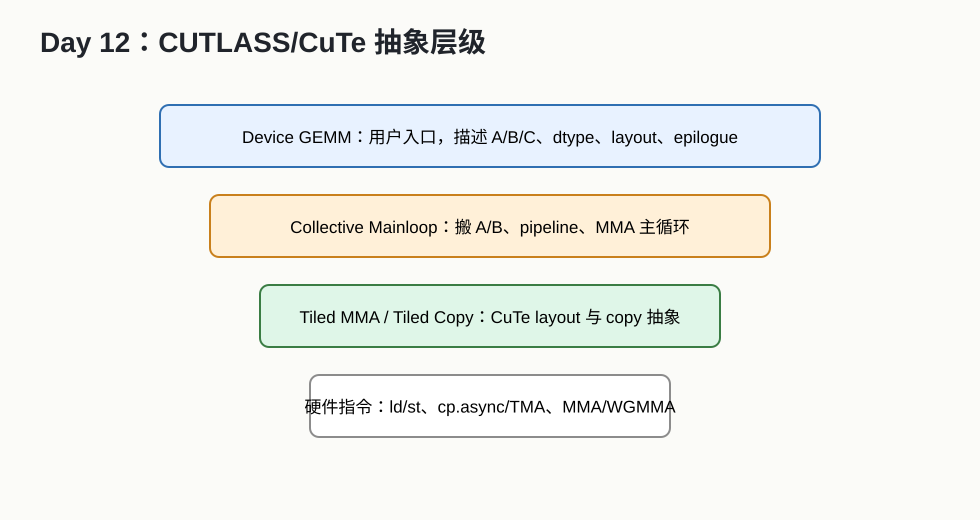

# Day 12：CUTLASS 与 CuTe 入门



## 今天的核心结论

CUTLASS 是 NVIDIA 官方的 CUDA C++ 模板库，核心价值是帮助你构建高性能 GEMM 及其变体。

你今天不用读懂所有模板。你要建立三点认知：

```text
1. CUTLASS 把 GEMM 拆成多层可组合抽象。
2. mainloop 负责搬 A/B 和 MMA 主计算。
3. epilogue 负责输出前的融合操作。
```

## 今天你要完成什么

最低 2 小时版：

1. 阅读 CUTLASS Efficient GEMM。
2. 看一个 CUTLASS GEMM example。
3. 标出 dtype、layout、tile shape、epilogue。

完整版 4-6 小时：

1. 编译一个 CUTLASS example。
2. 改 M/N/K。
3. 改 dtype 或 layout。
4. 记录结果。

## 必读资料与读法

1. [CUTLASS Efficient GEMM in CUDA](https://docs.nvidia.com/cutlass/latest/media/docs/cpp/efficient_gemm.html)  
   可靠性：A。
2. [CUTLASS 3.x GEMM API](https://docs.nvidia.com/cutlass/latest/media/docs/cpp/gemm_api_3x.html)  
   可靠性：A。
3. [CuTe GEMM Tutorial](https://docs.nvidia.com/cutlass/latest/media/docs/cpp/cute/0x_gemm_tutorial.html)  
   可靠性：A。
4. [CUTLASS GitHub](https://github.com/NVIDIA/cutlass)  
   可靠性：B，官方代码。

读法：

- 先读 Efficient GEMM 的图和文字。
- 再看 3.x GEMM API 的层级。
- CuTe 只先理解 layout/tile/copy 的动机。

## CUTLASS 和 cuBLAS 的区别

cuBLAS：

```text
高度优化的黑盒库，调用简单，性能强。
```

CUTLASS：

```text
开源模板库，允许你组合和定制 GEMM kernel。
```

使用场景：

- cuBLAS 已经满足需求：优先 cuBLAS。
- 需要自定义 epilogue/fusion：考虑 CUTLASS/cuBLASLt/Triton。
- 需要研究 GEMM kernel 结构：CUTLASS 很适合学习。

## CUTLASS 层级

### Device 层

用户入口。你配置：

- A/B/C dtype。
- layout。
- accumulator dtype。
- architecture。
- epilogue。

### Kernel 层

描述实际 kernel 结构。

### Collective / Mainloop 层

负责：

- A/B tile 读取。
- shared memory staging。
- pipeline。
- MMA 主循环。

### Epilogue 层

负责：

- accumulator 变成输出。
- alpha/beta。
- bias。
- activation。
- scale/cast。

### Atom 层

更接近硬件指令级：

- copy atom。
- MMA atom。

## 阅读 example 的方法

不要从模板定义一路跳到底。按表格读：

| 项 | 你要找什么 |
|---|---|
| ElementA/B/C | A/B/C dtype |
| LayoutA/B/C | row-major 还是 column-major |
| ElementAccumulator | 累加 dtype |
| OperatorClass | TensorOp 还是 Simt |
| ArchTag | 目标 GPU 架构 |
| ThreadblockShape | CTA tile |
| WarpShape | warp tile |
| InstructionShape | MMA tile |
| EpilogueOp | 输出融合 |

## 动手任务：example 阅读表

复制一个 CUTLASS example，填：

```text
文件名：
这个 example 做什么：
A dtype:
B dtype:
C dtype:
Accumulator dtype:
Layout A:
Layout B:
Layout C:
Threadblock shape:
Warp shape:
Instruction shape:
Epilogue:
我看不懂的 5 个模板参数:
```

## 如果你编译 CUTLASS

建议记录：

```text
GPU:
CUDA version:
CMake command:
Target architecture:
Example name:
Run command:
Output:
```

常见参数：

```text
SM80: Ampere A100 等
SM90: Hopper H100 等
```

具体以你的硬件为准。

## 常见错误排查

### 编译很慢

正常。CUTLASS 模板实例化可能很慢。

### 架构不匹配

可能原因：

- 编译目标 SM 和实际 GPU 不一致。
- 使用了硬件不支持的 dtype/指令。

### 看不懂模板

正常。按 example 表格读，不要追所有源码。

## 自测题

1. CUTLASS 和 cuBLAS 有什么区别？
2. mainloop 负责什么？
3. epilogue 负责什么？
4. CuTe 大概解决什么问题？
5. 什么情况下考虑 CUTLASS？

参考答案：

1. cuBLAS 是调用型库，CUTLASS 是可定制模板库。
2. A/B 搬运、pipeline、MMA。
3. accumulator 输出前的融合和类型转换。
4. 用统一 layout/tile 抽象表达张量和拷贝/计算。
5. GEMM 变体、自定义 epilogue、研究或定制高性能 kernel。

## 今天的验收标准

你能说清：

```text
CUTLASS 不是新手一天吃透的库；今天的目标是知道它如何把 GEMM 拆成 mainloop、MMA 和 epilogue，并能读一个 example 的 dtype/layout/tile 配置。
```

