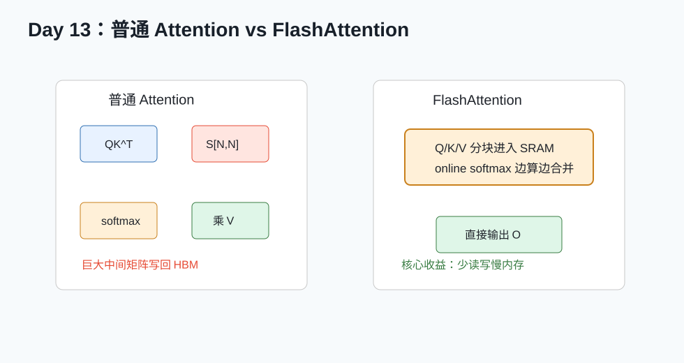

# Day 13：Attention 与 FlashAttention



## 今天的核心结论

FlashAttention 是算子优化的顶级案例之一。它的厉害之处不是“少算 attention”，而是：

```text
通过 tiling 和 online softmax，避免把巨大的 N x N attention matrix 写回 HBM。
```

它是 exact attention，不是近似 attention。

## 今天你要完成什么

最低 2 小时版：

1. 读 FlashAttention 中文讲解。
2. 看懂普通 attention 的数据流。
3. 写一份 500 字总结。

完整版 4-6 小时：

1. 读 FlashAttention 2022 摘要、introduction 和算法图。
2. 用 PyTorch 写普通 attention。
3. 估算中间矩阵显存。
4. 写 mini FlashAttention forward 伪代码。

## 必读资料与读法

1. 中文讲解：[FlashAttention 系列中文讲解](../paper_notes/04_FlashAttention系列_中文讲解.md)
2. 本地 PDF：[FlashAttention NeurIPS 2022](../papers/04_FlashAttention_NeurIPS2022.pdf)
3. 本地 PDF：[FlashAttention-2](../papers/05_FlashAttention2.pdf)
4. 本地 PDF：[FlashAttention-3](../papers/06_FlashAttention3.pdf)
5. [FlashAttention GitHub](https://github.com/Dao-AILab/flash-attention)

读法：

- 先读中文讲解。
- FlashAttention 2022：读摘要、introduction、算法图。
- FlashAttention-2：读摘要和方法动机。
- FlashAttention-3：读摘要，知道它面向 Hopper 和异步流水。

## 普通 attention

公式：

```text
O = softmax(QK^T / sqrt(d)) V
```

shape：

```text
Q: [N, d]
K: [N, d]
V: [N, d]
S = QK^T: [N, N]
P = softmax(S): [N, N]
O = PV: [N, d]
```

问题：

```text
S 和 P 都是 N x N。
当 N 很大，中间矩阵非常占显存，也带来大量 HBM 读写。
```

## 显存估算

如果：

```text
N = 4096
dtype = FP16 = 2 bytes
```

一个 `N x N` 矩阵大小：

```text
4096 * 4096 * 2 bytes ≈ 32 MB
```

S 和 P 两个矩阵就约 64 MB。多 head、多 batch、训练 backward 还会更大。

这就是为什么 attention 优化不是小事。

## 普通 attention PyTorch 参考

```python
def attention_ref(q, k, v, causal=False):
    d = q.shape[-1]
    scores = q @ k.transpose(-2, -1) / math.sqrt(d)
    if causal:
        n = q.shape[-2]
        mask = torch.triu(torch.ones(n, n, device=q.device, dtype=torch.bool), diagonal=1)
        scores = scores.masked_fill(mask, float("-inf"))
    probs = torch.softmax(scores, dim=-1)
    out = probs @ v
    return out
```

## FlashAttention 的思路

普通 attention：

```text
完整 S 写回 HBM
完整 P 写回 HBM
```

FlashAttention：

```text
Q block 固定
循环读取 K/V block
在片上算局部 scores
用 online softmax 更新结果
最终只写 O
```

核心：

- tiling。
- online softmax。
- 减少 HBM IO。

## Online Softmax 直觉

普通 softmax 要知道整行最大值和总和。

分块之后，你每次只看到一块。online softmax 维护：

```text
m: 当前已经看到元素的最大值
l: 当前 exp 的归一化 sum
o: 当前累积输出
```

新块到来：

```text
m_new = max(m_old, block_max)
旧的 l/o 按 exp(m_old - m_new) 缩放
新的 block 按 exp(block_scores - m_new) 加入
```

这样可以在不保存完整 S/P 的情况下得到 exact softmax。

## mini FlashAttention 伪代码

```text
for each Q_block:
    initialize m = -inf
    initialize l = 0
    initialize O_block = 0

    for each K_block, V_block:
        S_block = Q_block @ K_block^T / sqrt(d)
        if causal:
            apply mask

        m_new = max(m, rowmax(S_block))
        P_block = exp(S_block - m_new)

        alpha = exp(m - m_new)
        l = l * alpha + rowsum(P_block)
        O_block = O_block * alpha + P_block @ V_block
        m = m_new

    O_block = O_block / l
    write O_block
```

这个伪代码是理解用，不是工业级实现。真实实现还要处理：

- 多 head。
- batch。
- causal mask。
- dropout。
- backward。
- variable length。
- dtype。
- warp/block mapping。

## FlashAttention-2 的主线

FlashAttention-1 主要解决 IO。FlashAttention-2 进一步关注：

- 更好的并行划分。
- 减少非 matmul 部分开销。
- 让更多时间花在高吞吐矩阵乘上。

你可以记成：

```text
FA1：少搬数据。
FA2：少搬数据的同时，更好地分配工作。
```

## FlashAttention-3 的主线

FlashAttention-3 面向 Hopper 等新硬件，重点：

- 异步数据搬运和计算重叠。
- 使用新一代矩阵指令能力。
- 更好支持 FP8/低精度。

你可以记成：

```text
FA3：围绕新硬件能力重排流水线。
```

## 今天的输出模板

创建 `day13_flashattention_summary.md`：

```text
# FlashAttention 总结

## 1. 普通 attention 数据流

## 2. 为什么 N x N 中间矩阵贵

## 3. FlashAttention 的核心优化

## 4. Online softmax 我怎么理解

## 5. FA1 / FA2 / FA3 的区别

## 6. 我还没看懂的问题
```

## 自测题

1. FlashAttention 是近似算法吗？
2. 普通 attention 最大的中间矩阵是什么 shape？
3. online softmax 维护哪些量？
4. FlashAttention 为什么是 IO-aware？
5. FA2 相比 FA1 的优化方向是什么？

参考答案：

1. 不是，是 exact attention。
2. `N x N`。
3. 最大值、归一化 sum、累积输出。
4. 它围绕减少 HBM IO 设计计算顺序。
5. 更好的并行和工作划分，减少非 matmul 开销。

## 今天的验收标准

你能说清：

```text
FlashAttention 通过分块处理 Q/K/V，并用 online softmax 合并块结果，避免保存完整 N x N attention matrix，从而显著减少 HBM 读写。
```

