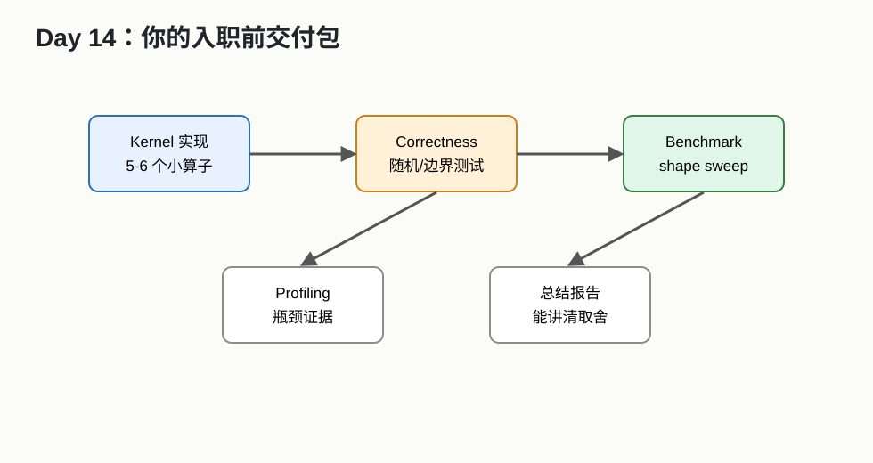

# Day 14：整理入职交付包



## 今天的核心结论

学习如果没有产物，很容易变成“我好像看过”。今天你要把前 13 天整理成能展示、能复盘、能继续扩展的工程包。

目标：

```text
让别人 5 分钟内看懂你做了什么，
让你自己 1 个月后还能接着做。
```

## 今天你要完成什么

最低 2 小时版：

1. 整理 README。
2. 汇总 benchmark 表。
3. 写 FlashAttention 总结。
4. 写入职第一周问题清单。

完整版 4-6 小时：

1. 整理所有代码目录。
2. 给每个算子补 correctness 说明。
3. 给每个算子补 benchmark 命令。
4. 写一份 2-3 页性能分析报告。

## 推荐目录结构

```text
operator_bootcamp/
  README.md
  environment.md
  kernels/
    vector_add/
    transpose/
    reduction/
    softmax/
    rmsnorm/
    matmul/
  triton/
    vector_add.py
    softmax.py
    matmul.py
  pytorch_custom_op/
    rmsnorm/
  tests/
  benchmarks/
    benchmark_summary.csv
  profiling/
  notes/
    day01_hardware_notes.md
    day02_roofline_worksheet.md
    day13_flashattention_summary.md
```

## README 模板

```text
# Operator Bootcamp

## 1. 项目目标

这个项目用于学习算子开发与优化，覆盖 CUDA/Triton/PyTorch custom op 的最小闭环。

## 2. 环境

GPU:
Driver:
CUDA/ROCm/CANN:
PyTorch:
Triton:
OS:

## 3. 已实现算子

| 算子 | 后端 | correctness | benchmark | 备注 |
|---|---|---|---|---|

## 4. 如何运行测试

## 5. 如何运行 benchmark

## 6. 主要结果

## 7. 我学到的关键点

## 8. 下一步计划
```

## benchmark 汇总表

| 日期 | 算子 | shape | dtype | baseline | my_impl | speedup | correctness | 硬件 | 备注 |
|---|---|---|---|---:|---:|---:|---|---|---|

注意：

- baseline 要写清楚是谁。
- shape 必须写。
- dtype 必须写。
- 硬件必须写。
- correctness 不能省。

## 性能分析报告模板

```text
# 性能分析报告

## 1. 背景

优化哪个算子？为什么它重要？

## 2. 语义

输入:
输出:
dtype:
layout:
边界条件:

## 3. Baseline

baseline 是什么？
运行命令是什么？
性能是多少？

## 4. 我的实现

实现思路:
关键参数:

## 5. 正确性

reference:
误差标准:
测试 shape:

## 6. 性能结果

表格:
图:

## 7. Profiling 观察

memory-bound 还是 compute-bound？
证据是什么？

## 8. 下一步优化
```

## 入职第一周问题清单

你可以直接带着这些问题去问 mentor：

1. 目标芯片/平台是什么？
2. 编程模型是什么？CUDA、HIP、Ascend C、BANG C、SYCL，还是自研 DSL？
3. 当前主要优化训练还是推理？
4. 当前最重要的模型和 shape 列表在哪里？
5. correctness reference 是什么？
6. 误差标准是什么？
7. benchmark harness 怎么跑？
8. profiler 用哪个？
9. 有没有历史 profiling 结果？
10. baseline 是谁？vendor library、旧 kernel、PyTorch，还是竞品？
11. 是否要求支持动态 shape？
12. 是否要求支持 non-contiguous？
13. 支持哪些 dtype？
14. 提交前必须跑哪些测试？
15. 性能回归怎么监控？

## 5 分钟自我介绍稿

你可以这样说：

```text
我入职前做了一个小型算子开发练习包，目标是建立从数学语义到 kernel、测试、benchmark 和 profiling 的闭环。

我做了 vector add、transpose、reduction、softmax、RMSNorm、matmul 这些练习。每个算子我都尽量写了 reference 对齐和 shape sweep benchmark。

在性能分析上，我重点学习了 Roofline，用算术强度先判断 memory-bound 或 compute-bound。对 attention，我读了 FlashAttention，理解了它通过 tiling 和 online softmax 减少 HBM IO 的主线。

我现在还不是专家，但我已经知道遇到一个算子任务时，要先确认语义、dtype、layout、shape、误差标准和 baseline，再用 benchmark/profiler 证实瓶颈。
```

## 最终检查清单

| 项 | 是否完成 |
|---|---|
| Day 1 硬件笔记 | |
| Day 2 Roofline worksheet | |
| vector add 代码 | |
| vector add benchmark | |
| transpose naive/tiled 对比 | |
| row-wise sum/max | |
| softmax reference | |
| softmax kernel/Triton | |
| RMSNorm/LayerNorm reference | |
| PyTorch custom op 笔记或代码 | |
| Triton vector add | |
| Triton softmax | |
| Triton matmul | |
| GEMM 学习报告 | |
| CUTLASS example 阅读表 | |
| FlashAttention 总结 | |
| benchmark 汇总表 | |
| 入职第一周问题清单 | |

## 自测题

1. 你能不能讲清每个算子的输入输出？
2. 你能不能说出每个 benchmark 的 baseline？
3. 你能不能解释至少一个算子的瓶颈？
4. 你能不能说出一个你实现里还不支持的情况？
5. 你能不能说出下一步优化计划？

如果都能，14 天的目标就达到了。

## 今天的验收标准

最终你要有：

```text
一个清晰 README
一张 benchmark 汇总表
一份性能分析报告
一份 FlashAttention 中文总结
一份入职第一周问题清单
```

这不是形式主义。这些材料会让你在入职时更稳：你不是“我看了一些资料”，而是“我完成了一个可验证的学习闭环”。

